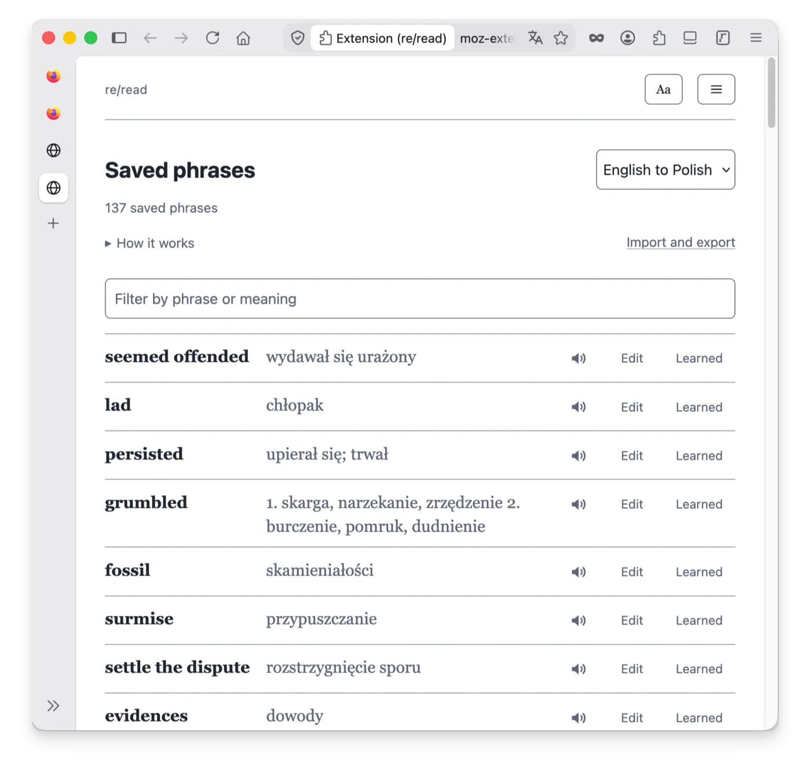

# re/read

A browser extension for reading - especially for reading in a language you are learning. Select a word or phrase to see its translation and save it; saved phrases are underlined on every page you visit, and one click marks a phrase as learned. Any page can be opened in the built-in reader and kept in the offline reading list; EPUB books can be imported and read the same way, translation bubble included. Everything is local: translation, dictionaries, vocabulary and the reading list are stored in the browser's local database on your device, work with no network, and nothing you read or select is ever sent anywhere.

Works in Firefox (desktop and Android) and in Chrome/Chromium. **Install it from [Firefox Add-ons](https://addons.mozilla.org/firefox/addon/reread/) or the [Chrome Web Store](https://chromewebstore.google.com/detail/cdeoicfidedlcapagmimcmmeeoplfcla)** (Brave and Edge use the same page); the [Install](#install) section has the details.


**Contents:** [Features](#features) · [Reading without translation](#reading-without-translation) · [Install](#install) · [Keyboard shortcuts](#keyboard-shortcuts) · [What it does not do](#what-it-deliberately-does-not-do) · [Privacy](#privacy) · [Third-party code](#third-party-code) · [Development](#development) · [Related projects](#related-projects) · [Licence](#licence) · [Feedback](#feedback) · [Support](#support)

## Features

**Translation**

- **Bubble on selection.** Select a word or phrase to see its translation. The engine (Bergamot - the technology behind Firefox's built-in page translation) is included in the extension and runs on your device, so translation works even in airplane mode.
- **About a hundred language pairs.** Models are downloaded once from the settings page - or added from your own files - and stored locally; an installed pair shows an Update button when Mozilla publishes a new build.
- **Dictionaries beside the engine.** A translation model has to pick one meaning; a dictionary lists them all. StarDict dictionaries - a catalogue of more than four hundred WikDict pairs installable with one click, or your own files - appear in the bubble under the translation - a setting can show them only after a press on **More** instead - and clicking a line attaches that meaning to the saved phrase. Install several, and two arrows on the settings page set the order in which their entries are shown.
- **Read aloud.** A phrase from the bubble, or a whole article in the reader - with live highlighting of the word being spoken, pause/resume, sentence skip and speed control. Only the device's offline voices are used: the online voices some browsers add (Chrome's "Google ..." voices, for example) are never listed and never used, and when the device has no offline voice for a language, nothing is read aloud and a message says so. The settings page lets you choose a voice for each language. A switch in the settings turns reading aloud off altogether - no speaker in the bubble, no Read-aloud button in the reader.

**Vocabulary**

- **Underlines everywhere.** A saved phrase is underlined on every page where it appears; click the underline to see your meaning again. **Learned** removes the phrase and its underline in one click. The underline is dotted and thin on purpose, so it does not distract while you read; the reader's **Aa** panel offers three thicknesses for screens on which the thinnest one is hard to see. Matching is exact by default: saving `read` underlines `read`. One setting, **Underline other forms of saved words**, extends it to `reads` and `reading` - the forms your installed dictionary confirms, English only for now - and the bubble over such a form shows what you saved and names the saved word.
- **Saved phrases page.** All your phrases with filtering, pagination, editing and Learned per row. Beside a phrase, two counts - a magnifier and a book: how many times you checked it (opened its bubble), and how many times it occurred in the texts you finished in the reader - a part of a book you left through **Next** under its text, an article you marked as read. The list can be ordered by either count, newest first, or alphabetically.
- **The sentence with the phrase.** One setting, **Save the sentence with the phrase** (off until you turn it on), saves with every phrase you save from the bubble the sentence around it - the sentence as the page shows it, never its translation. It is shown under the phrase on the saved phrases page, folded to one line, and it is what makes a sentence card in Anki (below). Only the first sentence is kept: saving the phrase again changes the meanings, not the sentence. For a phrase saved without a sentence - before you turned the setting on, from the **Add a phrase** field, or from a two-column file - the sentence around it is saved the next time you open its bubble on a page. The sentence is stored with the phrase, not with the article: deleting the article does not delete it. The bubble over a saved phrase does not show it - while you read, the sentence in front of you is the one that matters.
- **Look up a word without a page.** A field in the toolbar popup takes a word or phrase you type and shows your dictionaries' entries for it; **Add a phrase** on the saved phrases page does the same and lets you keep it - a tick on a meaning saves the phrase with that meaning, an untick takes it back, **Your own** at the end takes a meaning you write yourself, and **Show in list** brings the saved phrase's row into view (the popup only reads: its button **Save on the phrases page** takes you there with the word already looked up). The translation model is not asked here on purpose - a word on its own has no sentence around it, which is where the model guesses worst.
- **TSV import and export.** Move vocabulary to Anki or between devices; importing the same file twice never duplicates a phrase. In the file's meaning cell a semicolon followed by a space separates meanings, and a semicolon without a space stays inside its meaning. When you type several meanings of your own at once - in the phrases page's field or in the edit box - a semicolon separates them; a dictionary's own line with a semicolon in it stays one meaning until you edit that line. A second button, **Export for Anki**, writes a three-column file - phrase, meanings, and the sentence the phrase was saved in (empty when none was kept) - for Anki's sentence cards. Either file can be imported back; the three-column one includes the sentences, and for a phrase already saved the file's sentence is added only when the phrase has none of its own.



**Reader and reading list**

- **Reader mode.** Opens the page as a clean article in the extension's own tab - from the right-click menu (**re/read** → **Open in reading view**), from the page icon in the translation bubble, with `Alt`+`Shift`+`R`, or from the toolbar popup. **Full screen** in the reader's menu gives the article the whole screen: the browser hides its own bars until you press Back or `Esc`.
- **Offline reading list.** A saved article is stored in full on your device: it opens with no network, also when the original page has moved or disappeared. Pages opened in the reader are saved by default - one setting turns that off, and a page already in the list is never overwritten. Pictures are not saved by default: **Download pictures** in the reader's menu stores an article's pictures with it, on one press, and the list shows how many pictures an article keeps and how much space they take.
- **EPUB books.** Import a book into the reading list; long books are split into parts, and a table of contents is built from the chapter headings. A footnote opens in a small card next to its number. The pictures in the book file are kept with it and shown in the text (scaled down to screen size where that saves space); the list shows how many a book keeps and how much space they take, and **Remove pictures** in the reader's menu deletes them.
- **Reading position.** Every saved document reopens where you stopped.
- **Highlighter.** Highlights snap to whole words, can span paragraphs, come in a choice of colours and are stored with the saved copy. Tap a highlight and drag either of its two pins to make it shorter or longer, word by word. A Highlights page lists every mark with its note; each row can be read aloud, copied, opened in its document or deleted. The highlights travel in the backup of everything (see **Backup** below), for books too: a book can be deleted and imported again from the same `.epub` file without losing its highlights (nothing already there is changed or removed). The page exports them as a Markdown file of quotes for your notes, which cannot be imported. A highlight whose text has moved - a paragraph added above it, a book imported again - is found by its quote and shown at the right place; when the quoted text itself has changed, a message says so instead of the wrong words being marked. When the backup's highlights are imported into a book that is already in the list, each one is placed where its words stand in the book as it is now, even in another part of it - a book imported again from its `.epub` may be divided into parts differently from the one the highlights were made in; a highlight whose words cannot be found exactly once stays on the Highlights page, and the import report says how many. A highlight whose article is no longer in the reading list is kept: you can open the original page, delete the highlight, or delete all highlights of that page.
- **Search.** Inside the open document (articles, books part by part, live pages too) and across the whole reading list - in titles and, on request, in the stored texts, with snippets; clicking a snippet opens the document at that place.
- **Appearance.** Light, sepia and dark themes, serif or sans type - or any font installed on the device, typed by name in the settings and offered as **Custom** in the reader's **Type** row - text size and column width; links can be shown as plain text, so a book is shown without blue links. A small tab at the edge of the reader's bar hides the bar; the tab stays at the window's edge, and pressing it again brings the bar back.


**Data and interface**

- **Local database.** Vocabulary, models, dictionaries, articles and books are stored in the browser's local extension storage (IndexedDB) on your device - no account, no sync, no server.
- **Safety copies.** Your saved phrases, your highlights with their notes and the reading list keep a second copy in the extension's own storage. If the browser ever clears the databases, they are restored automatically. The copy of the reading list doubles the space the list takes, so one setting turns it off.
- **Backup.** **Export** on the reading list writes one `reread-backup.zip` with everything re/read keeps: the reading list with its highlights and reading positions (and its pictures when you tick the box), every saved phrase of every language pair with its sentence and counts, every document's highlights - books' too - and the settings. **Import** reads that file back part by part, adding what is missing and never overwriting what is here: an article already saved is not replaced, a saved phrase's meanings are not changed and only a missing sentence or a higher count is added, a highlight already here is left out, and the settings are restored only when you tick the box. The older files - the list's `.json` or `.zip`, the highlights' `.json` - still import. Press **Select**, tick some articles or books and export only those: a `reread-selection.zip` of the same kind, cut to what you ticked, for sharing - a ticked book goes with its pictures, a ticked article's pictures when you tick the box. After every export a line under the button says what went into which file, and its size. Books go into the backup only when you tick **Export with books** - their text and pictures, with the reading positions - and a book already in the list is never replaced; otherwise a book's backup is its `.epub`, and its highlights come back from the backup imported after the book. Vocabulary alone travels as TSV from the phrases page.
- **Toolbar popup.** Per-site off switch (a site can also be added by its address in the settings, under **Switched-off sites**), language pair, a field to look up a word, reader, reading list, saved phrases and settings in one place. The extension's own pages - reader, reading list, highlights, saved phrases, settings - share one tab instead of opening a new one each time.
- **Six UI languages.** English, Polish, German, French, Spanish, Ukrainian.
- **Custom CSS.** A field at the end of the settings page takes CSS rules of your own for the bubble, the reader page and the toolbar popup - never for the pages you read, and never for the settings page itself, so a wrong rule can always be undone there: clear the field and save. Rules that would load anything from the network are refused. The names come from the stylesheets in this repository (`src/content/tooltip.js` for the bubble, `src/reader/reader.css`, `src/popup/popup.css`, `src/assets/page.css`), which the settings page links to at the installed version; they are kept from version to version where possible, and a change is announced in the release notes.

## Reading without translation

re/read also works without machine translation. If you read in your own language, or with dictionaries instead of a translation model, one switch in the settings - **Use without a translation model** - turns the model off. The reading view, the offline reading list, the highlighter, read-aloud and search all keep working.

Dictionaries and saved phrases keep working. With a language pair chosen (the first dictionary you install sets it), selecting a word shows its dictionary meanings - looked up in the pair's language first, and then in the language the page declares when your dictionaries for the pair do not know the word, so an English word on a site whose interface is in Polish is read with your English dictionaries, and a Polish word on a Polish page still finds your Polish ones. The meanings stand in the same rows as on the saved phrases page - a dictionary per fold, a checkbox per meaning: ticking one saves the phrase (under the pair) at once, unticking takes the meaning back, and **Edit** in the bubble lets you type your own meaning, for a longer phrase for example. When there is nothing to show, a one-line message in the bubble says why: a partial word was selected, the word is not in your dictionaries (with a link to the list of dictionary sources), or no dictionary for that language is installed - the word "settings" in that line opens them at the dictionaries. Saved phrases stay underlined wherever you read - on ordinary pages as well, unless the "Only in the reader" switch limits the bubble to the reading view. A monolingual dictionary works the same way, and meanings can be read aloud in that language's voice. Nothing is deleted: saved phrases and models stay on the device and come back as soon as you switch the model on again.

A sub-option under that switch, **No bubble when selecting text**, is for people who select text to keep their place while reading: on ordinary pages nothing appears when you select text (the reader opens from the right-click menu, the toolbar button or with `Alt`+`Shift`+`R`), and in the reader a selection only highlights the text: no bubble appears, a tap or `Esc` removes the selection, `Ctrl`+`C` copies it.

## Install

- **Chrome or Chromium 128 or newer** - [re/read in the Chrome Web Store](https://chromewebstore.google.com/detail/cdeoicfidedlcapagmimcmmeeoplfcla). Brave and Edge install it from the same page. This minimum comes from `document.caretPositionFromPoint`, which the extension needs to tell which underline a tap or a click landed on.
- **Firefox 142 or newer** - [re/read on addons.mozilla.org](https://addons.mozilla.org/firefox/addon/reread/), on desktop and on Android. This minimum comes from the CSS Custom Highlight API (used to underline phrases without changing the page's HTML) and from the manifest key that declares the extension collects no data.

### Firefox on Android

The same package works on Android, same version floor. The popup opens from the ⋮ menu, under **Extensions**.

On a phone the extension starts in **reader-only mode**: ordinary pages are left alone, and selecting text offers one action - opening the page in the reader, where translation, saving and underlining work as usual. The reason: the translation bubble and Android's own copy menu compete for the same spot on screen. The mode is a regular setting (**Only in the reader**) and can be switched off for the full desktop behaviour.

**Getting to the reading list.** Press and hold on the text of any page and choose **Offline reading list** in the bubble, or open the popup (⋮ menu, **Extensions**, re/read). For a shortcut, open the reading list and choose **Add to shortcuts** in the Firefox menu: a tile on Firefox's start page - the page a new tab opens with - then opens it; a bookmark to the reading list page works the same way. **Add to Home screen** does not work for any extension's pages: the shortcut on the phone's home screen either never appears or shows a message that the app is not installed. That is a Firefox for Android limitation ([bug 1875695](https://bugzilla.mozilla.org/show_bug.cgi?id=1875695), open since 2024) - Firefox accepts only `http` and `https` addresses in home-screen shortcuts - and not something an extension can change. The tile and the bookmark contain the extension's internal address: it stays the same after an update, but changes after an uninstall and a fresh install, and the tile and the bookmark then have to be added again.

**Full screen.** The reader's menu (the ⋮ button in the reader's own bar) has a **Full screen** row: Firefox hides its address bar, Android hides its status bar, and the article gets the whole screen. The Back button or the back gesture brings them back; the row reads **Exit full screen** meanwhile and does the same. Firefox's own setting **Scroll to hide toolbar** hides the address bar only while a finger scrolls down and shows it again at every scroll up; the page-turn keys of an e-reader never hide it. A browser accepts the request only from a press, never from a page on its own, so after Firefox reopens the reader's tab the row has to be pressed again. Where the bar has room for it (a desktop, a tablet or an e-reader; a phone held upright usually does not), the bar of every page - the reader in each of its views, the saved phrases, the settings - also carries a full-screen button next to the menu: one press asks for the whole screen, and the same button - or Back, or Esc on a desktop - leaves it. The bar itself stays where it is, pinned to the top of every page; the small tab at the edge of the reader's bar is what folds that bar away.

**Private tabs.** In a private tab Firefox gives the extension's pages - reading list, reader, saved phrases - a separate database and deletes it when the private session ends. The pages fill it from the safety copies, so the reading list and the highlights show there as they are, but an article saved, a book imported, a highlight made or anything deleted in a private tab is gone with the session: the copies are read in private browsing and never written. Saved phrases are the one exception - they go through the extension's background, which is never private, and are kept. The pages show a notice about this at the top. Nothing is lost - the database of your normal tabs is unchanged - so open re/read from a normal tab again (Firefox shows a mask icon in private mode).

## Keyboard shortcuts

| Key | Where | Action |
|---|---|---|
| `Alt`+`Shift`+`R` | any page | open the page in the reader |
| `Esc` | any page | close the bubble |
| `PgDn` / `PgUp` | reader | turn the page: a screenful of text with the last line kept on top, whole lines under the bar |
| `⌥`+`↓` / `⌥`+`↑` | reader, macOS | the same page turn, for keyboards without page keys |
| `Space` / `Shift`+`Space` | reader, voice off | the same page turn |
| `Space` | reader, during read-aloud | pause / resume |
| `←` `→` | reader, during read-aloud | previous / next sentence |
| `<` `>` | reader, during read-aloud | slower / faster |

The read-aloud keys work only while the voice is reading; with the voice off, Space turns the page like `PgDn`. Keys pressed inside text fields, in open dialogs or on focused buttons are left alone.

## What it deliberately does not do

- **No accounts, no sync, no telemetry, no analytics.** There is no server.
- **No flashcards or spaced repetition.** Export your vocabulary to TSV - with the sentence each phrase was saved in, if you keep it - and use Anki; it does this better.
- **Matching is literal by default.** Saving `read` does not underline `reading` unless you turn on **Underline other forms of saved words** in the settings - and then only the forms your dictionary for the language confirms, for English only so far. No guessing by rule alone, and no forms for a word your dictionaries do not know.
- **Nothing inside embedded frames.** The extension works in the page you opened, not in embedded ads, players or widgets.
- **No remote code.** Everything that runs ships in the package (Manifest V3 enforces this anyway).
- **Books are imported as text and pictures only.** EPUB import takes the text and the pictures in the file: no publisher styling, no fonts, and no DRM - a protected book is not imported, and a message says why. The table of contents comes from the chapter headings in the text; the book's own TOC page and internal links are not followed. Footnotes are the one exception: a footnote's text is stored with the book at import and opens in a small card next to its number - the page does not scroll anywhere.

## Privacy

The extension connects to two servers whose addresses are built into the extension:

- Mozilla's storage bucket - the list of translation models and the models themselves,
- WikDict - the list of dictionaries and the dictionaries themselves.

Every request to them happens only when you click a button on the settings page; each list shows the date it was fetched, and download addresses are always taken from the copy inside the extension, never from a web page.

Requests to addresses that are not built in happen only when you ask for them. **Add a dictionary from a link** on the settings page downloads a dictionary archive from the address you paste there - once, without cookies, when you press **Download**; the address is yours, the extension suggests none, and a link is followed wherever its host sends it, which the page then says. **Download pictures**, a row in the reader's menu over a saved article, downloads that article's pictures from the addresses the pictures point at - the site the article came from, its image server, or another site the page embedded a picture from - once, without cookies or referrer, and only when you press it. The extension never downloads a picture on its own; a saved article contains only text until you press that row. Page text, your selections and your vocabulary never leave the device.

You can check this instead of trusting it: watch the network panel in the browser's developer tools, read the source code (published unminified), or simply turn the network off - translation, dictionaries and the reading list keep working. A test in the repository (`test/network-sinks.test.js`) lists every place in the code that can reach the network and fails the build when one is added.

The **Custom CSS** field on the settings page is not a way around this: the rules you type dress only the extension's own pages - the bubble, the reader and the toolbar popup - never the page you are reading, and a rule that would load anything from the network (`url()`, `@import`, `@font-face`) is refused before it is stored.

One thing a web page can see: on a page where your saved phrases are underlined, the page's own scripts can tell that re/read is installed and which of the page's words are underlined - the underlines are drawn with the browser's highlight registry, which the page shares. Nothing else is visible to it: not your vocabulary, not the bubble, not what you save. The **Only in the reader** setting keeps ordinary pages free of underlines altogether, so with it on no page can tell.

The same, written in the form the add-on stores require, in one document without legal language: [`PRIVACY.md`](PRIVACY.md).

Everything the extension stores - vocabulary, translation models, dictionaries, saved articles and books, settings - is stored in the browser's local extension storage on your device and is never synced anywhere: four IndexedDB databases (`reread-vocab`, `reread-articles`, `reread-dicts`, `reread-models`) and the extension's `storage.local`, which holds the settings and the safety copies of the vocabulary, the highlights and the reading list. You can look at all of it in the browser's developer tools, under the extension's own origin (Firefox: Storage; Chrome: Application). In particular:

- Switching re/read off for a site stores that site's hostname locally. Entries are listed and removable on the settings page.
- Saving an article stores its title, address and extracted text, so it opens with no network. Its pictures are stored only when you press **Download pictures** in the reader's menu (scaled down to screen size where that saves space). Once they are downloaded, that menu row changes to **Remove pictures**, which deletes them again. A book imported from an `.epub` file stores the pictures the file holds, scaled down the same way, with no network involved; the same **Remove pictures** row deletes them. The reading list shows how many pictures an article or a book has and how much space they take. Deleting an entry removes everything stored for it - text, pictures, highlights and notes, reading position - from the database and from the reading list's safety copy. Saved phrases are not part of an entry: a phrase you saved while reading an article stays in your vocabulary, with no record of where it came from, until you mark it **Learned**.
- Two counts are kept with each saved phrase: how many times you opened its bubble, and how many times it occurred in the texts you finished in the reader (a book part left through **Next** under its text, an article marked as read), each with the time it last happened. No page, title or text is stored with them - only how often. **Learned** deletes them with the phrase.
- Reading aloud uses the browser's own speech synthesis (the standard Web Speech API), and only its offline voices: a voice that would send the text to the browser maker's server to be spoken (Chrome's "Google ..." voices, Edge's "... Online" ones - `localService: false`) is not shown in any voice list and is never used. Which speech engine is used is a browser/OS setting; the extension itself makes no network request for reading aloud.
- Telling which language a selected phrase is in, before it is translated, uses the browser's built-in detector (`i18n.detectLanguage`, Compact Language Detector: CLD2 compiled into Firefox, CLD3 compiled into Chromium) - on the device, with no model download and no request; the text never leaves the browser. It is handed at most one sentence, the one around the selection, cut to 400 characters. Safari has no such detector, and re/read then skips the check. We re-check both browsers' source code with every release; [`PRIVACY.md`](PRIVACY.md) says what we can and cannot promise about it.

### Permissions

| Permission | Why |
|---|---|
| `storage` | Vocabulary and settings. Browser-local, never synced. |
| `unlimitedStorage` | Translation models are tens of megabytes and dictionaries can be more; the default quota is not enough. |
| `<all_urls>` | Saved phrases are underlined on **every** page, so the content script must run everywhere. This is a broad permission: it means the extension can read the pages you visit. It reads them locally to find your saved phrases, and sends nothing. |
| `contextMenus` | The **re/read** entries in the right-click menu - **Read this page in the reader** and **Offline reading list** - on any web page, for whoever never pinned the toolbar button. It adds two rows to the browser's menu and reads nothing; neither store asks for consent for it. |
| `offscreen` (Chromium package only) | Chromium runs the extension's background as a service worker, which cannot start the Web Worker the translation engine runs in. A single hidden document (offscreen document) runs that worker instead; it grants no access to any page or data. Firefox needs no equivalent and its package does not include this permission. |

There is nothing else - no `tabs`, no `webRequest`, no `cookies`, no `downloads`. The popup finds out which site it is on by asking the extension's own script already running on that page, not through the `tabs` API.

## Third-party code

Three components, all committed to the repository with their licence, provenance and SHA-256 checksums next to them. `tools/check-vendor.sh` verifies the checksums on every run of the quality gate.

- **[Bergamot](https://github.com/browsermt/bergamot-translator)** (MPL-2.0) - the translation engine: Marian NMT compiled to WebAssembly. Manifest V3 forbids remotely hosted code, so the engine is included in the extension package; this is also why the manifest declares `'wasm-unsafe-eval'` in its content security policy. Details: [`vendor/bergamot/README.md`](vendor/bergamot/README.md).
- **[Readability](https://github.com/mozilla/readability)** (Apache-2.0) - the article extractor behind Firefox's reader view, used by the reader mode. It runs on a separate, inactive copy of the page created with `DOMParser`, and its output is rebuilt from a list of allowed elements and attributes (never inserted as `innerHTML`), also every time a saved article is opened. Details: [`vendor/readability/README.md`](vendor/readability/README.md).
- **[fflate](https://github.com/101arrowz/fflate)** (MIT) - the ZIP reader behind EPUB import, the readable unminified build. Loaded by the reader page only when a book import starts, and only its synchronous single-entry API is used - chapters are unpacked one at a time, and the part of the library that starts worker threads is never called. Details: [`vendor/fflate/README.md`](vendor/fflate/README.md).

Besides those three, one table: `src/lib/dict/entities.js` is the [HTML standard's list of named character references](https://html.spec.whatwg.org/multipage/named-characters.html) (WHATWG, CC BY 4.0), generated by `tools/entities.mjs` from the standard's `entities.json`. It is what turns a dictionary entry's `&lsqb;`, `&rarr;` or `&frac12;` into the character its author meant, every name the standard has rather than a list of the ones met so far.

### Translation models

Models are Mozilla's own (MPL-2.0) - the same ones Firefox's page translation uses - downloaded from Mozilla's published storage bucket. The list of available models is Mozilla's index, fetched from an address written into the package; a copy included in the extension ([`src/lib/models/registry.json`](src/lib/models/registry.json)) makes the extension work offline from the first start.

Every download is verified before it is stored: declared sizes, Mozilla's published SHA-256, and a trial load in a fresh copy of the engine. Anything that fails is discarded. Downloads happen on the settings page, need no extra permissions, and can be cancelled.

### Dictionaries

Supported format: **StarDict** (`.ifo`, `.idx`, `.dict`/`.dict.dz`, optional `.syn`) - the same format [KOReader](https://koreader.rocks/) uses, so dictionaries can be shared between your e-reader and browser.

The settings page carries a catalogue of more than four hundred [WikDict](https://www.wikdict.com/) pairs (CC BY-SA, built from Wiktionary); one click downloads and installs a dictionary. A dictionary from anywhere else - a monolingual one, English-English for example - you add yourself: from files, or by pasting the address of its `.zip` archive under **Add a dictionary from a link** (the sources we know of, each stating its licence, are listed at [reapps.eu/read](https://reapps.eu/read#faq-dictionary-sources)). Dictionary downloads have no fixed checksum to compare against (WikDict rebuilds its files in place), but every archive is checked - a plain zip of StarDict files, with sizes and CRCs verified - and read carefully once, when it is added. Attribution is kept and shown on the settings page.

Dictionaries are matched by the language of their headwords, not by the pair - so a monolingual dictionary added from files or from a link (English-English, for example) is shown next to the bilingual ones: in the bubble under the translation while translating (only after a press on **More** once you turn "Show the sentence and dictionary entries right away" off in the settings), and directly in the bubble with translation switched off.

A translation model often gets a word on its own wrong, and a dictionary is the better answer to one. So when you select a word or two while translating and no dictionary entry stands under the translation, a line in the bubble says so, and which of two things it means: no dictionary for the language is installed yet (the word "settings" in that line opens them at the dictionaries), or the installed ones do not know the word - with a link to the list of dictionary sources, its address on the link.

The model translates only from the pair's language, and a page in your own language can feed it the wrong one - a Polish word on a Polish page under English → Polish comes back as nonsense. So before the model is asked, the extension checks which language the selection is in, locally: the browser's own language detector reads the sentence around it (Firefox and Chromium build one in; it needs no permission and no network), and the dictionaries are asked in the language it found - or, when it is not sure, in the pair's language first and in the language the page declares second, as with the model off. When the sentence reads as your own language, or a dictionary of another language knows the selected word while the pair's do not, the model is not asked at all: the bubble shows that language's dictionary entries instead - or says that no dictionary for it is installed yet, or that none of yours knows the word - says where Save would file the phrase, reads it aloud in that language, and keeps nothing on its own. The detector's verdict counts only when it names the pair's target language or the language the page declares; a page in some third language still gets the model's answer, and a single word with no sentence around it is left to the dictionaries.

With more than one installed, the bubble shows their entries in the order the settings page lists the dictionaries, and two arrows on each row change that order - put the English-English one above the English-Polish one and its entries come first.

A dictionary's name comes from its file and can be a whole sentence, which breaks the heading of its entries into several lines. The **Display name** field under **Details** on its row in the settings takes a shorter one, up to 40 characters, and that name is the row's title and heads the dictionary's entries in the bubble, in the popup and on the phrases page; clearing the field brings the file's name back. Two dictionaries cannot be shown under one name.

For English-Polish, WikDict is the recommended start: 66,609 entries plus 51,721 alternative spellings in its `.syn` file (which is what lets `elevations` find `elevation`). FreeDict's `eng-pol` StarDict build (release 0.2.1) is mostly missing the Polish translations (checked 2026-08-11); other FreeDict pairs may be fine.

## Development

Plain JavaScript with JSDoc types (TypeScript as a checker only, `--noEmit`), bundled by esbuild because content scripts cannot be ES modules, shipped unminified. No runtime dependencies beyond the three vendored components above.

```bash
npm install
npm run build            # Firefox package in dist/firefox
npm run build:chromium   # Chromium package in dist/chromium
npm run build:safari     # Safari package in dist/safari, synced into safari/ (see below)
tools/check.sh           # quality gate: vendor checksums, typecheck, tests, all builds, addons-linter
```

`tools/check.sh` is exactly what CI runs. A build loads as a temporary extension in Firefox (`about:debugging`) or an unpacked one in Chrome (`chrome://extensions` → Load unpacked → `dist/chromium`). The practical notes - AMO signing for a build that survives a Firefox restart, quirks of unpacked Chrome loads, regenerating the model registry and the dictionary catalogue, code layout - are in [`docs/DEVELOPMENT.md`](docs/DEVELOPMENT.md).

**Safari (iOS/iPadOS, experimental - not yet in the App Store):** Safari installs extensions only inside a native app, so `safari/` holds a minimal Xcode wrapper - one screen that says what the extension is and how to turn it on, a required no-op message handler, nothing else. `npm run build:safari` builds the same extension for Safari (the manifest differences are in `tools/manifest-target.mjs`, like Chromium's) and syncs it into the wrapper's gitignored `Resources/` directory; then `safari/reread.xcodeproj` builds and runs it on a device from Xcode. Verified on an iPad Pro (2018); requires Safari 18.2+ for detecting taps on underlines - on older versions that part does not work, the rest does.

## Related projects

By the same foundation:

- **[re/apps](https://github.com/fundacja-reborn/reapps)** - open-source, end-to-end encrypted productivity apps: **[re/notes](https://reapps.eu/notes)** (notes and documents in Markdown) and **[re/task](https://reapps.eu/task)** (task management). All data is encrypted on your device before it reaches the server.
- **[offlinetranslate-koplugin](https://github.com/fundacja-reborn/offlinetranslate-koplugin)** - offline translation while reading for [KOReader](https://koreader.rocks/), an open-source e-book reader popular on e-ink devices. It uses the same TSV format for saved phrases, so vocabulary collected on an e-reader can be imported here and underlined in your browser, and vice versa.

## Licence

[AGPL-3.0-or-later](LICENSE), the same as the KOReader plugin it exchanges files with.

## Feedback

Found a bug, missing something, or want to say how re/read works for you? [Open an issue](https://github.com/fundacja-reborn/reread-webext/issues), or write to [@reapps_eu on Mastodon](https://mastodon.social/@reapps_eu). Both go straight to the people who make it - the switches that turn off reading aloud and the bubble came from exactly such a message.

## Support

re/read is built by a non-profit foundation - no investors, no ads, no tracking. If you find it useful and want to support its continued development, every donation helps us build software free from commercial pressure.

→ [**Donate via Wise**](https://wise.com/pay/business/fundacjareborn?description=Donation+-+statutory+purposes)

→ [**More ways to support**](https://reapps.eu/#support)

---

Built with privacy in mind by [Fundacja Reborn](https://reborn.org.pl) (Poland).
