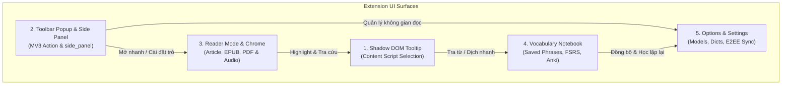
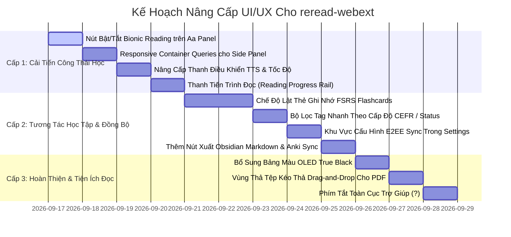

# Báo Cáo Đánh Giá Toàn Diện UI/UX & Lộ Trình Nâng Cấp Trải Nghiệm Người Dùng `reread-webext`

**Dự án:** `reread-webext` (v0.5.61)  
**Tổ chức:** Fundacja Reborn ([fundacja-reborn/reread-webext](https://github.com/fundacja-reborn/reread-webext))  
**Hệ sinh thái liên kết:** [reapps](https://github.com/fundacja-reborn/reapps) ([reapps.eu](https://reapps.eu))  
**Giấy phép:** AGPL-3.0-or-later  
**Ngày đánh giá:** 16/09/2026  
**Phương pháp tiếp cận:** Senior Dev "Ponytail" Anti-Bloat, Native CSS/DOM, WCAG AAA & E-Ink 16-Grayscale First  

---

## 1. Tổng Quan & Triết Lý Thiết Kế Hiện Tại

`reread-webext` sở hữu một hệ thống giao diện đặc thù và được chăm chút rất kỹ lưỡng về mặt công thái học. Khác biệt hoàn toàn với các extension thông thường vốn lạm dụng framework (React, Vue, Tailwind, Bootstrap), `reread-webext` xây dựng toàn bộ hệ thống giao diện trên nền tảng **Pure Native CSS/DOM** với các nguyên tắc cốt lõi:

1. **Hiệu Năng & Zero-Bloat (Ponytail Philosophy)**:
   - Không runtime framework, không CSS-in-JS overhead.
   - Sử dụng CSS Custom Properties (`--page-bg`, `--page-fg`, `--page-accent`, `--page-line`, `--page-border`) để đồng bộ trạng thái giao diện xuyên suốt tất cả các trang nội bộ (`options`, `reader`, `vocab`, `popup`) và Shadow DOM content script (`tooltip.css`).
2. **Khả Năng Tương Thích Tuyệt Đối Với Màn Hình E-Ink (Boox, Onyx, Kindle Browsers)**:
   - Giới hạn 16 mức xám (16 greys): loại bỏ hoàn toàn các bóng mờ (`box-shadow`), gradient mờ ảo hoặc màu pastel nhạt vốn bị tấm nền e-ink làm phẳng (flatten) thành màu trắng hoặc vệt loang lổ.
   - Sử dụng đường viền sắc nét 1px đặc (`border: 1px solid var(--page-border)`) với độ tương phản vượt ngưỡng 4.5:1.
   - Hạn chế tối đa animation phức tạp gây chớp nháy (flashing/ghosting) khi e-ink phải quét lại toàn màn hình (repaint).
3. **Tiêu Chuẩn Tiếp Cận Nghiêm Ngặt (Accessibility - WCAG AAA)**:
   - Sàn chạm tối thiểu (Touch Target Floor) đạt **44px x 44px** trên mọi nút bấm, dòng chọn, liên kết điều hướng và ô nhập liệu.
   - Tỷ lệ tương phản chữ/nền vượt ngưỡng 7:1 (đạt 11:1 đến 15:1 trên cả 3 theme: Light, Dark, Sepia).
   - Đảm bảo trạng thái bàn phím (`:focus-visible`) với vòng viền 2px tương phản cao, hỗ trợ đầy đủ ARIA landmark roles và nhãn ẩn cho Screen Readers (`.visually-hidden`).

---

## 2. Kiểm Tra & Đánh Giá Chi Tiết Từng Bề Mặt Giao Diện (Surface Audit)

Dưới đây là kết quả rà soát chi tiết 5 bề mặt giao diện chính của tiện ích:



---

### 2.1 Bề Mặt 1: Khung Tra Cứu Nổi (Shadow DOM Tooltip & Dictionary Shelf)
*Tệp nguồn:* [`src/content/tooltip.css`](file:///d:/Code/reread-webext/src/content/tooltip.css), [`src/content/tooltip.js`](file:///d:/Code/reread-webext/src/content/tooltip.js), [`src/lib/lookup-shelf.js`](file:///d:/Code/reread-webext/src/lib/lookup-shelf.js).

#### Ưu Điểm Đang Có:
- **Cô lập Shadow DOM**: Tách biệt hoàn toàn styles của bubble khỏi CSS của trang web máy chủ (không bị CSS reset hay `!important` từ website ngoài can thiệp).
- **Định vị thông minh (`data-grow="up" | "down"`)**: Tự động lật hướng hiển thị khi vùng chọn văn bản nằm gần đỉnh hoặc đáy viewport mà không che khuất dòng đang đọc.
- **Tích hợp hình thái học đa ngữ**: Hiển thị rõ ràng dạng gốc (lemma) của từ đã phân tích khử biến tố (deinflected headwords), phân loại từ loại (POS), phát âm IPA và nhãn cấp độ CEFR (A1–C2).
- **Thao tác nhanh không cần mở tab**: Nút Lưu (`Save`), Nghe phát âm (`Speak`), Sao chép (`Copy`), Mở chế độ đọc (`Reader`).

#### Hạn Chế & Vấn Đề Công Thái Học (UX Bottlenecks):
1. **Mật độ thông tin quá dày khi tra nhiều từ điển**: Khi người dùng cài đặt 2-3 từ điển StarDict/MDX, bubble trở nên rất dài. Các mục nghĩa xếp chồng liên tiếp; người dùng phải cuộn chuột nhiều mà không có tab lọc nhanh theo từ điển hoặc nút nhảy tới từ loại mong muốn (`[Noun]`, `[Verb]`, `[Adj]`).
2. **Hàng nút tác vụ (Action Row) khi hiển thị trên màn hình hẹp**: Hàng nút `[Save] [Speak] [Copy] [More]` tự bung mở bằng hiệu ứng mở hàng lưới (`grid-template-rows: 0fr -> 1fr`). Trên một số màn hình cảm ứng hoặc văn bản dài, nút bấm bị rớt hàng không đồng đều.
3. **Thiếu phản hồi trạng thái phát âm audio**: Nút phát âm (hình loa) khi được nhấn chỉ gọi TTS phát tiếng mà không có biểu tượng sóng âm chuyển động nhẹ (playing animation) để người dùng biết âm thanh đang được nạp hoặc đang đọc câu dài.

---

### 2.2 Bề Mặt 2: Cửa Sổ Tiện Ích & Bảng Điều Khiển Cạnh (Toolbar Popup & Chrome Side Panel)
*Tệp nguồn:* [`src/popup/index.html`](file:///d:/Code/reread-webext/src/popup/index.html), [`src/popup/popup.css`](file:///d:/Code/reread-webext/src/popup/popup.css), [`src/popup/index.js`](file:///d:/Code/reread-webext/src/popup/index.js).

#### Ưu Điểm Đang Có:
- **Cấu trúc 11 dòng phân cấp chuẩn xác ("Hành lang, không phải phòng ở")**: Ưu tiên các tác vụ dùng hàng ngày ở trên cùng (Bật/tắt trên trang này, Mở Reader, Chọn cặp ngôn ngữ, Ô tra từ trực tiếp) và dồn các cài đặt hiếm khi dùng xuống đáy.
- **Khởi tạo siêu tốc (Zero-Latency Render)**: Hiển thị ngay trạng thái ban đầu mà không đợi nạp mô hình từ IndexedDB, triệt tiêu hiện tượng xê dịch layout (Layout Shift) khiến click nhầm.
- **Kết hợp ô tra từ (`lookup-box`)**: Cho phép gõ tra từ trực tiếp ngay trong popup mà không cần bôi đen văn bản trên trang.

#### Hạn Chế & Điểm Nghẽn Trải Nghiệm Lớn Nhất (Major Bottleneck):
1. **Không thích ứng linh hoạt trong Chrome MV3 Side Panel**:
   - Trong `manifest.json`, extension đã khai báo `side_panel: { "default_path": "popup/index.html" }`.
   - Tuy nhiên, trong [`popup.css`](file:///d:/Code/reread-webext/src/popup/popup.css#L8), `body` đang bị **khóa cứng chiều rộng**:
     ```css
     body {
       width: 19rem; /* ~304px */
       margin: 0;
       padding: 0.4rem 0.9rem;
     }
     ```
   - **Hậu quả UX**: Khi người dùng mở tiện ích trong Chrome Side Panel và kéo dãn bảng điều khiển sang 400px, 600px hoặc 800px, nội dung của popup vẫn bị bó hẹp trong một cột 304px đơn độc ở bên trái, để lại một khoảng trống hoang phí ở bên phải.
   - **Cơ hội nâng cấp**: Ứng dụng **CSS Container Queries (`@container`)** để khi ở chế độ Side Panel rộng, giao diện tự động chuyển thành dạng 2 cột: Cột trái là danh mục điều hướng nhanh/tra từ, cột phải là bản xem trước kết quả từ điển hoặc danh sách bài viết đọc gần đây!

---

### 2.3 Bề Mặt 3: Chế Độ Đọc Tập Trung & Thanh Điều Khiển (Reader Mode & Chrome)
*Tệp nguồn:* [`src/reader/reader.html`](file:///d:/Code/reread-webext/src/reader/reader.html), [`src/reader/reader.css`](file:///d:/Code/reread-webext/src/reader/reader.css), [`src/reader/controllers/`](file:///d:/Code/reread-webext/src/reader/controllers/).

#### Ưu Điểm Đang Có:
- **Thanh điều khiển thông minh (`.page-chrome` & `#chrome-tab`)**: Thanh công cụ dính trên đỉnh nhưng có thể gập gọn hoàn toàn bằng một lần nhấn vào ruy-băng `#chrome-tab` ("bookmark ribbon") để trải nghiệm đọc toàn màn hình không bị phân tâm.
- **Tùy biến Typography chuyên sâu (Bảng điều khiển Aa)**: Đổi theme (Light, Sepia, Dark), kiểu chữ (Serif, Sans, Custom user font), kích thước font chữ, độ rộng dòng văn bản (`Width: 65ch`).
- **Tích hợp TTS Karaoke**: Tự động cuộn trang và làm nổi bật câu đang được đọc bằng giọng nói máy.

#### Hạn Chế & Tính Năng Mới Chưa Có Giao Diện (Feature Gaps):
1. **Thiếu nút gạt Bionic Reading trên bảng Aa**:
   - Ở Giai đoạn 4, chúng ta đã phát triển thành công module [`src/lib/bionic.js`](file:///d:/Code/reread-webext/src/lib/bionic.js) và bộ điều khiển [`AppearanceController.toggleBionic()`](file:///d:/Code/reread-webext/src/reader/controllers/appearance-controller.js).
   - Tuy nhiên, trên giao diện bảng Aa (`#display-panel`) trong `reader.html` **chưa hề có nút bật/tắt chế độ Bionic Reading**! Người dùng không có cách nào kích hoạt tính năng đột phá này từ UI.
2. **Thanh điều khiển giọng đọc nổi (`#speech-bar`) còn quá đơn điệu**:
   - Thanh đọc hiện chỉ có 4 nút cơ bản: `[Back]` `[Play/Pause]` `[Stop]` `[Forward]`.
   - Thiếu hiển thị tiến độ đọc câu trực quan: ví dụ `Câu 14 / 86` hoặc thanh tiến trình mini (progress scrub bar).
   - Thiếu nút đổi tốc độ đọc nhanh (ví dụ nút pill `1.0x`, `1.2x`, `1.5x` ngay trên thanh âm thanh mà không phải mở bảng điều khiển Aa).
3. **Chưa có thanh chỉ báo tiến độ đọc bài viết (Reading Progress Rail)**:
   - Đối với những bài viết dài hoặc chương sách EPUB/PDF, thiếu một thanh mỏng (2px) ở đỉnh màn hình thể hiện tỷ lệ phần trăm đã đọc (`42% - còn khoảng 4 phút đọc`), giúp người đọc kiểm soát thời gian.
4. **Vùng thả tệp (Drag-and-Drop Dropzone) cho PDF & EPUB**:
   - Thư viện đọc offline (`#library`) hiện ẩn tính năng nhập tệp dưới liên kết mờ nhạt `#transfer`. Cần một vùng kéo thả trực quan: *"Thả tệp .epub hoặc .pdf vào đây để đọc ngay lập tức"*.

---

### 2.4 Bề Mặt 4: Sổ Tay Từ Vựng & Thẻ Ghi Nhớ (Vocabulary Notebook)
*Tệp nguồn:* [`src/vocab/vocab.html`](file:///d:/Code/reread-webext/src/vocab/vocab.html), [`src/vocab/vocab.css`](file:///d:/Code/reread-webext/src/vocab/vocab.css), [`src/vocab/vocab.js`](file:///d:/Code/reread-webext/src/vocab/vocab.js).

#### Ưu Điểm Đang Có:
- **Hiển thị ngữ cảnh câu nguyên bản**: Mỗi từ vựng lưu trữ đi kèm câu văn thực tế được trích từ bài đọc, giúp học từ theo văn cảnh tự nhiên.
- **Bộ lọc tìm kiếm và sắp xếp mạnh mẽ**: Lọc từ theo chuỗi tìm kiếm, sắp xếp theo: Mới nhất (`Newest`), Tra cứu nhiều nhất (`Most checked`), Đọc gặp nhiều nhất (`Most read`), Thứ tự bảng chữ cái (`A-Z`).
- **Xem trước nhập/xuất tệp TSV/Anki**: Xác thực số lượng dòng và mẫu từ vựng trước khi ghi đè vào IndexedDB.

#### Hạn Chế & Cơ Hội Nâng Cấp Lớn (Transformative Opportunities):
1. **Chưa có giao diện ôn tập Spaced Repetition (FSRS Flashcard Mode)**:
   - Ở Giai đoạn 3, chúng ta đã tích hợp thuật toán Spaced Repetition hiện đại nhất thế giới: **FSRS v4.5** ([`src/lib/fsrs.js`](file:///d:/Code/reread-webext/src/lib/fsrs.js)).
   - Tuy nhiên, trang `vocab.html` hiện tại chỉ là một **danh sách phẳng thụ động** để duyệt và xóa từ. Người dùng chưa thể nhấn nút *"Ôn tập hôm nay (15 từ)"* để lật flashcard và đánh giá nhớ từ theo 4 cấp độ: `Again (1)`, `Hard (2)`, `Good (3)`, `Easy (4)`.
2. **Thiếu bộ lọc Tag/Pill theo cấp độ CEFR và mức độ ghi nhớ**:
   - Hiện tại người dùng chỉ có thể lọc bằng cách gõ từ khóa. Chưa có các nút chip chọn nhanh: `[Tất cả]` `[Cần ôn hôm nay]` `[Đã thuộc]` `[CEFR: B1]` `[CEFR: B2]`.
3. **Thiếu nút xuất trực tiếp sang Obsidian Markdown**:
   - Module [`src/lib/export-markdown.js`](file:///d:/Code/reread-webext/src/lib/export-markdown.js) đã sẵn sàng tạo tệp Markdown chuẩn Obsidian với frontmatter YAML và Wikilinks, nhưng phần `#transfer` trong `vocab.html` mới chỉ có nút "Export" và "Export for Anki".

---

### 2.5 Bề Mặt 5: Trang Cài Đặt (Options & Dashboard)
*Tệp nguồn:* [`src/options/options.html`](file:///d:/Code/reread-webext/src/options/options.html), [`src/options/options.css`](file:///d:/Code/reread-webext/src/options/options.css), [`src/options/options.js`](file:///d:/Code/reread-webext/src/options/options.js).

#### Ưu Điểm Đang Có:
- **Tôn trọng quyền riêng tư tuyệt đối**: Bố cục trang mở đầu bằng cam kết rõ ràng về tính năng Offline-First và nguồn tải mã nguồn mở minh bạch.
- **Trình soạn thảo Custom CSS trực quan**: Cho phép người dùng tự viết mã CSS để tinh chỉnh giao diện đọc theo ý thích với nút kiểm tra cú pháp an toàn.

#### Hạn Chế & Thiếu Sót Giao Diện (Feature Gaps):
1. **Chưa có giao diện cấu hình Đồng bộ mã hóa đầu-cuối (E2EE Sync Settings)**:
   - Ở Giai đoạn 5, chúng ta đã xây dựng hoàn chỉnh giao thức đồng bộ Zero-Knowledge chuẩn quân sự AES-GCM-256 + PBKDF2 ([`src/lib/sync/e2ee.js`](file:///d:/Code/reread-webext/src/lib/sync/e2ee.js) & [`src/lib/sync/client.js`](file:///d:/Code/reread-webext/src/lib/sync/client.js)).
   - Trong `options.html`, hiện **chưa có khu vực để người dùng điền URL máy chủ Sync, nhập Mật khẩu giải mã (Passphrase), xem thời gian đồng bộ lần cuối và nút "Đồng bộ ngay" (Sync Now)**.
2. **Trang cài đặt quá dài khi xem trên màn hình lớn**:
   - Toàn bộ cài đặt được xếp thẳng hàng trên một trang duy nhất. Khi cuộn xuống cuối, các liên kết nhảy nhanh `.jump` ở trên cùng bị trôi mất, khiến việc quay lại đầu trang tốn công sức.
3. **Chưa hiển thị trạng thái của Chrome Built-in AI Translation**:
   - Ở Giai đoạn 2, chúng ta đã bổ sung provider Chrome AI Translator ([`src/lib/translator/providers/chrome-ai.js`](file:///d:/Code/reread-webext/src/lib/translator/providers/chrome-ai.js)). Cần một thẻ trạng thái nhỏ trong phần Cài đặt dịch thuật để thông báo cho người dùng biết trình duyệt của họ đã hỗ trợ AI On-Device hay chưa (`Readily Available` / `After Download` / `Not Supported`).

---

## 3. Bản Đồ Tokens Thiết Kế & Nguyên Tắc Tối Ưu E-Ink (Design System Audit)

### 3.1 Hệ Thống Bảng Màu (Color Tokens) Hiện Tại
Tất cả màu sắc được định nghĩa tại [`src/assets/page.css`](file:///d:/Code/reread-webext/src/assets/page.css):

| Token | Light Theme | Dark Theme | Sepia Theme | Đề Xuất Mới: OLED Black | Mục Đích Sử Dụng |
|---|---|---|---|---|---|
| `--page-bg` | `#ffffff` | `#171a21` | `#f4ecd8` | **`#000000`** | Nền chính của trang đọc và các cửa sổ |
| `--page-fg` | `#1f2430` | `#ccd3df` | `#322a21` | **`#e0e0e0`** | Màu chữ nội dung (đảm bảo độ tương phản AAA) |
| `--page-muted` | `#5c6478` | `#98a1b5` | `#6b5f4d` | **`#888888`** | Chú thích, số đếm, nhãn phụ, ngày tháng |
| `--page-line` | `#99a1b0` | `#565d6c` | `#a3937a` | **`#333333`** | Đường kẻ phân cách thụ động giữa các mục |
| `--page-border`| `#6e7583` | `#767e8f` | `#83745a` | **`#555555`** | Viền khung nút bấm, ô input, dropdown |
| `--page-accent`| `#b8791d` | `#f09a3e` | `#9a5b16` | **`#e5a93c`** | Màu điểm nhấn cho nút bấm chính, highlight |
| `--surface-raised`| `#ffffff` | `#20242d` | `#f8f4e8` | **`#121212`** | Bề mặt nổi (Popup, Modal, Dialog) |

> [!NOTE]
> **Đề xuất bổ sung Theme "OLED True Black" (`#000000`)**:
> Hiện tại theme Dark đang sử dụng màu nền xám than chì `#171a21`. Đối với người dùng đọc sách ban đêm trên màn hình OLED (điện thoại Android, laptop OLED), màu đen tuyệt đối `#000000` giúp tắt hoàn toàn các điểm ảnh phát quang, tiết kiệm tối đa pin và giảm mỏi mắt tuyệt đối.

### 3.2 Quy Tắc Bất Di Bất Dịch Cho Màn Hình E-Ink
Khi nâng cấp bất kỳ thành phần UI nào, bắt buộc phải tuân thủ nghiêm ngặt các quy chuẩn kỹ thuật đã được kiểm chứng trên thiết bị Boox / Kindle:
1. **Không dùng `box-shadow` mờ làm tín hiệu duy nhất**: Mọi khối nổi (Card, Dialog, Tooltip) bắt buộc phải có `border: 1px solid var(--page-border)` bao quanh.
2. **Không dùng màu nhạt (translucent washes < 15%) để biểu thị trạng thái đã chọn**: Trên màn hình 16 mức xám, màu nhạt sẽ bị lượng tử hóa thành màu trắng của nền giấy, khiến người dùng không phân biệt được nút nào đang được bật.
3. **Tôn trọng `prefers-reduced-motion`**: Trên thiết bị e-ink, mọi hiệu ứng CSS transition thời gian dài sẽ biến thành chuỗi giật hình (ghosting). Cần lập tức tắt mọi hiệu ứng khi thiết bị yêu cầu giảm chuyển động.

---

## 4. Lộ Trình Đề Xuất Nâng Cấp UI/UX Toàn Diện (Actionable Roadmap)

Lộ trình được chia làm 3 cấp độ ưu tiên, áp dụng triệt để nguyên lý Senior Dev Ponytail: **dùng sức mạnh có sẵn của nền tảng web hiện đại, mã nguồn ngắn gọn nhất, không thêm thư viện ngoài**.



---

### 4.1 Cấp Độ 1: Hoàn Thiện Các Tính Năng Cốt Lõi Đang Thiếu Trên Giao Diện (Quick Wins & High Impact)

#### Nhiệm Vụ 1.1: Bổ Sung Nút Bật/Tắt Bionic Reading Trong Bảng Aa Của Reader
- **Hiện trạng:** Logic `bionic.js` và `AppearanceController` đã hoàn tất ở Phase 4 nhưng chưa có nút bấm trên giao diện.
- **Giải pháp:**
  - Trong [`src/reader/reader.html`](file:///d:/Code/reread-webext/src/reader/reader.html), thêm một hàng tùy chọn mới trong bảng `#display-panel`:
    ```html
    <div class="reader-setting" id="bionic-setting">
      <span class="reader-setting-name" data-i18n="reader_bionic">Bionic</span>
      <span class="reader-choices" id="bionic-choices">
        <button type="button" data-bionic="off" aria-pressed="true" data-i18n="option_off">Off</button>
        <button type="button" data-bionic="on" aria-pressed="false" data-i18n="option_on">On</button>
      </span>
    </div>
    ```
  - Kết nối sự kiện trong `src/reader/reader.js` gọi thẳng `appearanceController.toggleBionic()`.
  - Giữ lại trạng thái người dùng trong `storage.local`.

#### Nhiệm Vụ 1.2: Tối Ưu Hóa Giao Diện Popup Thích Ứng Mượt Mà Khi Làm Chrome MV3 Side Panel
- **Hiện trạng:** Khi mở Side Panel trên Chrome (`side_panel: popup/index.html`), chiều rộng bị ghim chặt ở `19rem` (~304px), để lại khoảng trống lãng phí khi người dùng kéo rộng thanh bên.
- **Giải pháp:**
  - Trong [`src/popup/popup.css`](file:///d:/Code/reread-webext/src/popup/popup.css), thiết lập `container-type: inline-size; container-name: popup-container;`.
  - Thay thế thuộc tính cứng `width: 19rem` bằng `width: 100%; max-width: 100%; min-width: 18rem;`.
  - Sử dụng Container Queries:
    ```css
    @container popup-container (min-width: 480px) {
      body {
        padding: 0.8rem 1.4rem;
        font-size: 15px;
      }
      .popup-row {
        padding: 0.75rem 0;
      }
      /* Chuyển các nút tác vụ thành dạng lưới 2 cột khi ở thanh bên rộng */
      .popup-side-grid {
        display: grid;
        grid-template-columns: 1fr 1fr;
        gap: 0.5rem 1rem;
      }
    }
    ```

#### Nhiệm Vụ 1.3: Nâng Cấp Thanh Giọng Đọc Nổi (TTS Speech Bar)
- **Hiện trạng:** Thanh âm thanh `#speech-bar` chỉ có 4 nút cơ bản, không biết bài đọc đang ở đâu và không thể chỉnh tốc độ nhanh.
- **Giải pháp:**
  - Bổ sung bộ đếm câu trực quan: `<span id="speech-sentence-counter" class="speech-counter">12 / 85</span>`.
  - Bổ sung nút bấm nhanh tốc độ đọc chu kỳ: `<button id="speech-quick-rate" class="speech-rate-pill">1.0&times;</button>` (nhấn vào sẽ đổi vòng tròn: `1.0x` -> `1.2x` -> `1.5x` -> `1.8x` -> `0.8x` -> `1.0x`).
  - Đảm bảo hiển thị tối ưu trên cả giao diện mobile và e-ink.

#### Nhiệm Vụ 1.4: Bổ Sung Thanh Chỉ Báo Tiến Trình Đọc (Reading Progress Rail) & Ước Lượng Thời Gian
- **Hiện trạng:** Bài viết dài trong chế độ đọc không có thanh chỉ báo trực quan người dùng đã cuộn được bao nhiêu phần trăm trang.
- **Giải pháp:**
  - Thêm một thanh tiến trình siêu nhẹ 2px dính sát ngay dưới `.reader-bar`:
    ```html
    <div id="reader-progress-rail" class="reader-progress-rail" aria-hidden="true">
      <div id="reader-progress-bar" class="reader-progress-bar"></div>
    </div>
    ```
  - Cập nhật tỷ lệ cuộn bằng `requestAnimationFrame` trên sự kiện cuộn trang mà không gây giật lag.
  - Hiển thị ước tính thời gian đọc ngay dưới tiêu đề bài viết: `<span class="reader-reading-time">~6 phút đọc &middot; 1.420 từ</span>`.

---

### 4.2 Cấp Độ 2: Tương Tác Học Tập & Đồng Bộ Hóa Nâng Cao (Core Learning & Sync Upgrades)

#### Nhiệm Vụ 2.1: Chế Độ Ôn Luyện Thẻ Ghi Nhớ FSRS (Spaced Repetition Review Modal)
- **Hiện trạng:** Đã có thuật toán FSRS v4.5 ([`src/lib/fsrs.js`](file:///d:/Code/reread-webext/src/lib/fsrs.js)) nhưng trong Sổ tay từ vựng `vocab.html` chưa có giao diện ôn tập.
- **Giải pháp:**
  - Bổ sung nút nổi bật trên đầu trang `vocab.html`:  
    `<button type="button" id="start-review-btn" class="review-trigger-btn">Ôn tập thẻ ghi nhớ (<span id="due-count">0</span> từ cần ôn)</button>`
  - Tạo hộp thoại ôn tập chuẩn HTML5 `<dialog id="review-dialog" class="review-modal">`:
    - Mặt trước: Từ vựng + Nút phát âm loa + Nút "Hiển thị câu ngữ cảnh" (ẩn nghĩa).
    - Mặt sau (sau khi nhấn Lật thẻ / Spacebar): Hiển thị tất cả các nghĩa đã lưu, câu ngữ cảnh và 4 nút đánh giá chuẩn FSRS:
      1. `Again (Lặp lại - <10m)` [Phím 1]
      2. `Hard (Khó - 1d)` [Phím 2]
      3. `Good (Tốt - 3d)` [Phím 3]
      4. `Easy (Dễ - 7d)` [Phím 4]
  - Lưu kết quả đánh giá trực tiếp vào cấu trúc dữ liệu từ vựng trong IndexedDB và cập nhật lịch ôn tiếp theo.

#### Nhiệm Vụ 2.2: Bộ Lọc Thẻ Chip Theo Cấp Độ CEFR & Trạng Thái
- **Hiện trạng:** Chỉ có ô tìm kiếm chuỗi ký tự thông thường.
- **Giải pháp:**
  - Thêm thanh thẻ chip cuộn ngang:
    ```html
    <div class="vocab-chips-bar" role="toolbar" aria-label="Bộ lọc nhanh">
      <button type="button" class="chip active" data-filter-tag="all">Tất cả</button>
      <button type="button" class="chip" data-filter-tag="due">Cần ôn hôm nay</button>
      <button type="button" class="chip" data-filter-tag="new">Mới lưu</button>
      <button type="button" class="chip" data-filter-cefr="a1">A1</button>
      <button type="button" class="chip" data-filter-cefr="a2">A2</button>
      <button type="button" class="chip" data-filter-cefr="b1">B1</button>
      <button type="button" class="chip" data-filter-cefr="b2">B2</button>
      <button type="button" class="chip" data-filter-cefr="c1">C1</button>
    </div>
    ```

#### Nhiệm Vụ 2.3: Thẻ Cấu Hình Đồng Bộ Mã Hóa Đầu-Cuối (E2EE Sync Settings Card)
- **Hiện trạng:** Đã có lõi mã hóa PBKDF2 + AES-GCM và client đồng bộ ([`src/lib/sync/`](file:///d:/Code/reread-webext/src/lib/sync/)), nhưng trong `options.html` chưa có chỗ cho người dùng cấu hình.
- **Giải pháp:**
  - Thêm một phân đoạn riêng biệt `#sync` trong [`src/options/options.html`](file:///d:/Code/reread-webext/src/options/options.html):
    - Mục nhập: **Sync Server URL** (mặc định để trống hoặc cấu hình máy chủ cá nhân tự lưu trữ).
    - Mục nhập: **Passphrase (Mật khẩu giải mã đầu-cuối)**: Mật khẩu này không bao giờ được gửi lên server; được dùng sinh khóa cục bộ qua PBKDF2 (100.000 vòng lặp).
    - Thẻ trạng thái: **Trạng thái đồng bộ gần nhất** (ví dụ: *"Đã đồng bộ thành công lúc 17:45 - 142 từ vựng, 18 bài viết"*).
    - Nút tác vụ: **[Đồng bộ ngay bây giờ]**.

#### Nhiệm Vụ 2.4: Bổ Sung Tác Vụ Xuất Obsidian Markdown & Đồng Bộ Trực Tiếp AnkiConnect
- **Hiện trạng:** Đã có module `export-markdown.js` và `anki-connect.js`.
- **Giải pháp:**
  - Trong khu vực `#transfer` của `vocab.html`, bổ sung 2 nút tác vụ:
    - `<button type="button" id="export-obsidian">Xuất Obsidian Markdown (.md)</button>`: Tải về tệp Markdown hoàn chỉnh tương thích Obsidian Vault.
    - `<button type="button" id="sync-ankiconnect">Đồng bộ trực tiếp AnkiConnect</button>`: Gửi trực tiếp thẻ từ vựng vào Anki Desktop đang chạy thông qua cổng localhost:8765 mà không cần người dùng nhập file thủ công!

---

### 4.3 Cấp Độ 3: Hoàn Thiện Trải Nghiệm Người Dùng (Polish & Advanced Accessibility)

#### Nhiệm Vụ 3.1: Bổ Sung Bảng Màu OLED True Black
- **Giải pháp:**
  - Trong `src/assets/page.css`, thêm thuộc tính chọn theme: `:root[data-reader-theme="oled"]`.
  - Nền đen sâu `#000000`, viền `#333333`, văn bản màu xám bạc dịu `#dcdcdc`, điểm nhấn màu hổ phách ấm `#e5a93c`.
  - Bổ sung nút chọn "OLED" trong bảng điều khiển Aa của Reader và Vocab.

#### Nhiệm Vụ 3.2: Vùng Kéo Thả (Drag-and-Drop Dropzone) Trong Thư Viện Đọc Offline
- **Giải pháp:**
  - Trong giao diện `#library` (`src/reader/reader.html`), tạo một vùng kéo thả thân thiện khi danh sách bài viết đang trống hoặc trên đầu danh sách:
    ```html
    <div id="library-dropzone" class="library-dropzone">
      <p>Kéo thả tệp <strong>.epub</strong> hoặc <strong>.pdf</strong> vào đây để đọc ngoại tuyến</p>
      <button type="button" id="browse-file-btn">Hoặc chọn tệp từ máy tính</button>
    </div>
    ```
  - Tự động nhận diện phần mở rộng tệp: nếu là `.epub` chuyển sang `import-book.js`, nếu là `.pdf` chuyển sang `pdf-viewer.js`.

#### Nhiệm Vụ 3.3: Bảng Hướng Dẫn Phím Tắt Tiện Dụng (Keyboard Shortcut Overlay)
- **Giải pháp:**
  - Nhấn phím `?` ở bất kỳ trang nào để mở một modal trợ giúp nhẹ giải thích các phím tắt bàn phím:
    - `Space`: Cuộn trang / Lật thẻ ghi nhớ
    - `j` / `k`: Chuyển đoạn hoặc chuyển bài
    - `p`: Đọc to / Tạm dừng giọng nói TTS
    - `b`: Bật/Tắt chế độ Bionic Reading
    - `f`: Bật/Tắt chế độ toàn màn hình
    - `Esc`: Đóng popup hoặc bảng điều khiển

---

## 5. Kế Hoạch Kiểm Thử & Tiêu Chí Nghiệm Thu (Verification Matrix)

| Thành phần UI/UX | Phương pháp kiểm thử | Tiêu chí nghiệm thu |
|---|---|---|
| **Bionic Reading Toggle** | Unit test DOM state + Thủ công trên Reader | Nút bấm phản hồi `aria-pressed`, thêm thuộc tính `data-bionic="true"` vào root, văn bản bôi đậm 40-50% âm tiết đầu. |
| **Side Panel Container Queries** | Resize kiểm tra kích thước từ 320px đến 800px | Không còn khoảng trắng thừa, bố cục co giãn tự nhiên không bị vỡ layout. |
| **TTS Audio Progress Bar** | Unit test audio controller + Test nghe câu | Đếm câu chính xác `X / Y`, nút bấm tốc độ đọc xoay vòng chuẩn `0.8x -> 1.0x -> 1.2x -> 1.5x`. |
| **FSRS Flashcard Modal** | Unit test `fsrs.js` + Test lật thẻ | Nhấn lật thẻ hiển thị câu ngữ cảnh & nghĩa, chọn 1 trong 4 điểm cập nhật lịch ôn tiếp theo trong IndexedDB. |
| **E2EE Sync Card** | Mock Sync Server + Unit test mã hóa WebCrypto | Lưu passphrase an toàn, mã hóa payload đúng chuẩn AES-GCM trước khi gửi, hiển thị thông báo trạng thái đồng bộ rõ ràng. |
| **Accessibility (WCAG AAA)** | `axe-core` / Chrome Lighthouse Audit | Đạt điểm Accessibility 100/100, 0 lỗi tương phản màu sắc, 0 lỗi thiếu nhãn form. |
| **E-Ink Compatibility** | Giả lập 16 mức xám (Grayscale render) | Mọi đường viền, nút bấm và chữ viết đều sắc nét, không bị nhạt nhòa hoặc biến mất thành nền trắng. |

---

## 6. Kết Luận

Bản đánh giá trên khẳng định kiến trúc kỹ thuật hiện tại của `reread-webext` đã đạt đến độ chín muồi rất cao về độ tin cậy và sự tinh gọn. Những nâng cấp UI/UX được đề xuất trong báo cáo này **không làm phình to codebase** mà tập trung vào:
1. **Mở khóa toàn bộ tiềm năng của các module đã xây dựng ở các giai đoạn trước** (Bionic Reading, FSRS Flashcards, E2EE Sync, Obsidian Export, Side Panel).
2. **Nâng tầm trải nghiệm người dùng hiện đại, thông minh và công thái học hơn**.
3. **Bảo tồn trọn vẹn di sản triết lý**: Offline-First, Zero-Knowledge, siêu nhẹ (Ponytail) và hoàn hảo trên cả màn hình thông thường lẫn thiết bị E-Ink.
