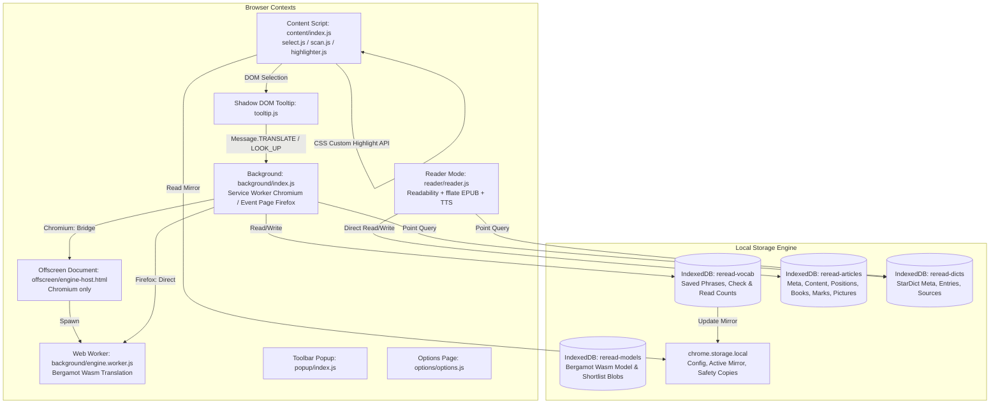
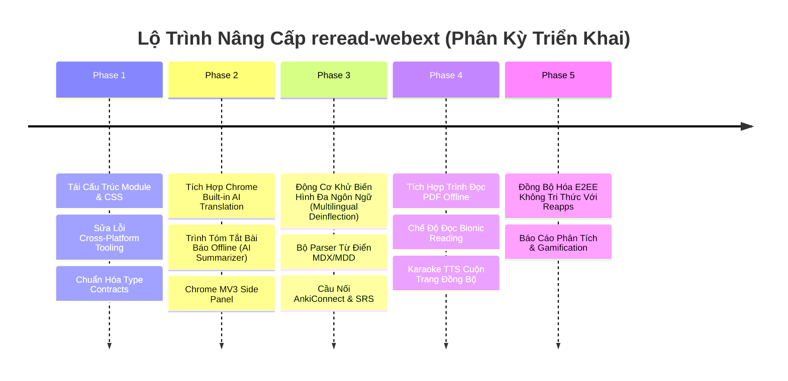

# Báo Cáo Nghiên Cứu Chuyên Sâu & Đề Xuất Nâng Cấp Kiến Trúc `reread-webext`

**Dự án:** `reread-webext` (v0.5.61)  
**Tổ chức:** Fundacja Reborn ([fundacja-reborn/reread-webext](https://github.com/fundacja-reborn/reread-webext))  
**Hệ sinh thái liên kết:** [reapps](https://github.com/fundacja-reborn/reapps) ([reapps.eu](https://reapps.eu))  
**Giấy phép:** AGPL-3.0-or-later  
**Ngày nghiên cứu:** 16/09/2026  

---

## 1. Tổng Quan & Kiến Trúc Hiện Tại Của Repository

`reread-webext` là một tiện ích mở rộng trình duyệt (WebExtension) hướng tới trải nghiệm học ngoại ngữ khi duyệt web và đọc sách dài kỳ. Điểm đặc thù và cốt lõi nhất của dự án là **Zero-Knowledge, Offline-First & Privacy-First**: toàn bộ dữ liệu (từ vựng, mô hình dịch máy, từ điển StarDict, bài báo đã lưu, sách EPUB, highlight và ghi chú) đều nằm trọn vẹn trong trình duyệt của người dùng thông qua IndexedDB và Web Extension Storage; tuyệt đối không có máy chủ trung gian, không gửi dữ liệu ra ngoài và không có telemetry/analytics.

### 1.1 Bản Đồ Công Nghệ & Luồng Dữ Liệu



### 1.2 Điểm Mạnh Vượt Trội Của Codebase Hiện Tại
1. **Chất lượng kiểm thử & độ tin cậy cực cao**:
   - **1.806 unit test cases** chạy qua 420 test suites trong chưa đầy 10 giây sử dụng Node.js native test runner (`node --test`), **0 lỗi, 0 cảnh báo**.
   - Kiểm thử tĩnh toàn diện: TypeScript typecheck (`tsc --noEmit`), web-ext lint (AMO addons-linter với tiêu chuẩn 0 lỗi, 0 warning, 0 notice).
   - Kiểm soát cổng mạng nghiêm ngặt (`test/network-sinks.test.js`): Bất kỳ lời gọi `fetch`, `WebSocket`, `XMLHttpRequest` phát sinh ngoài danh mục được phê duyệt trong `README.md` đều lập tức bẻ gãy CI.
2. **Triết lý kỹ thuật Senior "Ponytail" (Anti-Bloat)**:
   - Không lạm dụng framework (không React/Vue/Svelte rườm rà). Toàn bộ DOM được kiến tạo qua Native DOM APIs và CSS Custom Variables.
   - Tận dụng chuẩn web hiện đại: `DecompressionStream` cho gzip/dictzip/deflate, `CSS.highlights` (`::highlight(reread-saved)`) để gạch chân từ vựng mà không phá vỡ DOM cây của trang web hay xung đột với các SPA (Single Page Applications).
   - Quản lý tương tác đa thẻ an toàn bằng Web Locks (`navigator.locks`).
3. **Thiết kế giao diện công thái học & Thân thiện với màn hình E-Ink**:
   - Các bảng màu (Light, Dark, Sepia) đạt chuẩn tương phản cao **WCAG AAA (> 7:1)**.
   - Tối ưu đặc thù cho tấm nền E-Ink (Boox, Kindle-style browsers) với 16 mức xám, loại bỏ bóng mờ (box-shadow) vô nghĩa và đảm bảo viền phân cách luôn rõ nét.

---

## 2. Phân Tích Các Nút Thắt & Hạn Chế Kỹ Thuật (Audit & Diagnostics)

Dù codebase có chất lượng rất cao, quá trình nghiên cứu cấu trúc sâu qua CodeGraph và rà soát mã nguồn đã chỉ ra các hạn chế cần nâng cấp:

### 2.1 Kiến Trúc & Tổ Chức Mã Nguồn (Code Smells & Monoliths)
| Tệp nguồn | Kích thước | Số dòng | Vấn đề kỹ thuật |
|---|---|---|---|
| `src/reader/reader.js` | 294 KB | ~7.250 dòng | **God Object / Monolithic Module**: Gom toàn bộ logic của 5 miền độc lập: (1) Trình hiển thị bài báo Reader & Book EPUB; (2) Bộ điều khiển công cụ Highlight/Ghi chú; (3) Bộ điều khiển TTS đọc to & hát karaoke; (4) Quản lý thư viện/danh sách đọc & sao lưu ZIP; (5) Bảng điều khiển giao diện Appearance & Fullscreen. |
| `src/content/tooltip.js` | 146 KB | ~3.158 dòng | Chứa chuỗi template literal CSS khổng lồ (`const STYLE = ...`, hơn 1.000 dòng CSS trong JS). Thiếu highlight cú pháp CSS, không thể tận dụng CSS linter, khó tái sử dụng giữa các môi trường Shadow DOM. |
| `src/options/options.js` | 130 KB | ~2.800 dòng | Gom tất cả các tab cài đặt (Mô hình dịch, Từ điển, Danh sách loại trừ web, Giao diện, Nhập/Xuất sao lưu) vào một tệp xử lý duy nhất. |

### 2.2 Động Cơ Ngôn Ngữ & Hình Thái Học (Linguistic & Deinflection Limitations)
- Trong `src/lib/dict/deinflect.js`:
  ```javascript
  // Dòng 33:
  export const RULED_LANGUAGE = "en";
  ```
- **Hạn chế**: Tính năng **"Gạch chân các dạng khác của từ đã lưu"** (`Underline other forms of saved words`) hiện tại **CHỈ hỗ trợ duy nhất Tiếng Anh**!
- Khi người dùng học Tiếng Đức (`de`), Tiếng Pháp (`fr`), Tiếng Tây Ban Nha (`es`), Tiếng Ba Lan (`pl`), Tiếng Ukraina (`uk`) hoặc Tiếng Việt (`vi`), việc lưu một động từ nguyên thể (ví dụ: `gehen`, `aller`, `hablar`, `czytać`) sẽ **hoàn toàn không thể gạch chân** khi từ đó xuất hiện ở dạng chia thì (`geht`, `allons`, `habló`, `czytam`). Đây là lỗ hổng trải nghiệm lớn đối với một extension học ngôn ngữ.

### 2.3 Công Nghệ Dịch & Đột Phá AI Bản Địa Trên Trình Duyệt (AI & Browser APIs)
- Hiện tại, `reread-webext` chỉ hỗ trợ mô hình Bergamot Marian NMT (biên dịch sang WebAssembly). Người dùng phải tải về các tệp mô hình từ 15 MB đến 35 MB cho mỗi cặp ngôn ngữ vào IndexedDB.
- **Tiến bộ trình duyệt (2025 - 2026)**:
  - Chrome / Chromium đã chính thức ra mắt **Built-in On-Device AI Translation API** (`window.translation.createTranslator(...)` hoặc `window.ai.translator`).
  - API này chạy trực tiếp mô hình nén được tối ưu hóa ở tầng native của trình duyệt, **không tốn dung lượng download thêm**, tốc độ dịch nhanh hơn 3-5x và tiết kiệm pin đáng kể.
  - Ngoài ra, Chrome còn hỗ trợ **Summarization API** (`window.ai.summarizer`), cho phép tóm tắt nhanh nội dung bài báo offline. Hiện extension chưa tích hợp những năng lực mới này.

### 2.4 Hạn Chế Về Định Dạng Tài Liệu (Document Formats)
- Extension hỗ trợ đọc bài viết web (HTML qua Readability) và sách EPUB (qua fflate).
- **Thiếu định dạng PDF**: Tài liệu nghiên cứu, sách học thuật, báo cáo và giáo trình ngoại ngữ đa phần ở định dạng PDF. Khi người dùng mở một tệp PDF trên trình duyệt, content script hiện tại không thể tương tác trực quan với văn bản bên trong trình xem PDF mặc định của trình duyệt.

### 2.5 Hạn Chế Về Định Dạng Từ Điển
- Hiện tại chỉ hỗ trợ định dạng StarDict (`.ifo`, `.idx`, `.dict.dz`).
- Trong cộng đồng người học ngoại ngữ quốc tế, các định dạng từ điển bách khoa chất lượng cao như **MDX/MDD (Mdict)** và **Yomichan JSON / Epwing** chiếm thị phần rất lớn (Oxford, Cambridge Advanced, Collins COBUILD). Việc thiếu parser MDX làm giảm nguồn từ điển của người dùng.

### 2.6 Khả Năng Liên Kết Hệ Sinh Thái Reapps & Đồng Bộ Hóa
- Dự án `fundacja-reborn/reapps` là ứng dụng ghi chú & quản lý công việc mã hóa đầu-cuối (E2EE Zero-Knowledge).
- Mặc dù cùng thuộc hệ sinh thái Reborn, `reread-webext` hiện chưa có cơ chế đồng bộ hóa mã hóa E2EE trực tiếp với tài khoản Reapps. Người dùng phải xuất/nhập tệp sao lưu zip/tsv thủ công giữa các thiết bị.

---

## 3. Bản Đề Xuất Nâng Cấp Toàn Diện (Strategic Upgrade Proposals)

Dựa trên nguyên tắc phát triển: **"Giữ vững cam kết bảo mật Zero-Knowledge, trung thành với triết lý tối giản Anti-Bloat, nhưng nâng cấp vượt trội về công nghệ và trải nghiệm"**, dưới đây là 5 trụ cột nâng cấp được phân kỳ:



---

### Trụ Cột 1: Tái Cấu Trúc Mã Nguồn & Tối Ưu Hóa Bảo Trì (Architecture & Clean Code)

#### 1.1 Phân rã `src/reader/reader.js` thành các Controller chuyên biệt
Tách tệp 7.200 dòng thành cấu trúc module phân tầng trong `src/reader/`:
- `src/reader/controllers/article-viewer.js`: Chuyên trách render nội dung bài viết HTML, xử lý phân đoạn, footnotes và ảnh.
- `src/reader/controllers/epub-viewer.js`: Chuyên trách giải nén EPUB, mục lục (TOC), phân đoạn sách theo dung lượng màn hình.
- `src/reader/controllers/mark-manager.js`: Quản lý thao tác kéo pin, snap chữ, đổi màu bút dạ, tự phục hồi vị trí highlight khi văn bản thay đổi (Quote Healing).
- `src/reader/controllers/tts-player.js`: Điều phối Web Speech API, highlight karaoke theo từng từ đang đọc, phím tắt điều khiển.
- `src/reader/controllers/library-shelf.js`: Quản lý danh sách đọc offline, tìm kiếm toàn văn, thống kê dung lượng ảnh.
- `src/reader/controllers/appearance.js`: Quản trị font chữ, cỡ chữ, khoảng cách lề, chế độ tương phản cao e-ink.
- `src/reader/reader.js`: Giữ vai trò entry-point điều phối mỏng (~200 dòng), liên kết các controller.

#### 1.2 Trích xuất CSS từ `src/content/tooltip.js`
- Chuyển toàn bộ 1.000+ dòng CSS dạng string sang tệp độc lập: `src/content/tooltip.css`.
- Cấu hình `esbuild` trong `tools/build.mjs` với loader `text` hoặc plugin CSS inject:
  ```javascript
  import tooltipStyles from "./tooltip.css";
  // Gắn vào Shadow Root:
  shadow.adoptedStyleSheets = [sheet]; // hoặc style tag
  ```
- **Lợi ích**: Tận dụng triệt để CSS nesting, stylelint, cú pháp hiện đại và giảm kích thước bộ nhớ khi script content nạp vào trang web.

#### 1.3 Hoàn thiện công cụ kiểm tra đa nền tảng
- Cập nhật các script trong `tools/` (như `tools/lint.mjs` đã được tinh chỉnh) để chạy mượt mà trên cả Windows (PowerShell/CMD), macOS và Linux mà không phát sinh lỗi liên quan đến đường dẫn hay spawn command.

---

### Trụ Cột 2: Tích Hợp Chuẩn Web & Trí Tuệ Nhân Tạo Bản Địa (Modern Browser & Built-in AI)

#### 2.1 Nhà Cung Cấp Dịch Thuật Bản Địa Chrome (`ChromiumNativeTranslator`)
Hiện tại `src/lib/translator/index.js` đã được thiết kế sẵn theo mẫu Factory/Strategy (`setProvider`). Ta có thể bổ sung provider mới:
- **Tệp mới**: `src/lib/translator/providers/chrome-ai.js`
  ```javascript
  export const chromeAiTranslator = {
    id: "chrome-ai",
    async translate({ text, from, to }) {
      if (typeof window.translation?.createTranslator !== "function") {
        return null;
      }
      const can = await window.translation.canTranslate({ sourceLanguage: from, targetLanguage: to });
      if (can === "no") return null;
      const translator = await window.translation.createTranslator({ sourceLanguage: from, targetLanguage: to });
      const gloss = await translator.translate(text);
      return ok({ gloss, sentence: null });
    }
  };
  ```
- **Ưu điểm**:
  - Đối với người dùng Chrome/Edge/Brave: Cung cấp bản dịch câu và cụm từ tức thì **mà không cần tải 30MB tệp mô hình Bergamot**.
  - Nếu trình duyệt chưa hỗ trợ Built-in AI, hệ thống tự động fallback êm xuôi về Bergamot Wasm.

#### 2.2 Trình Tóm Tắt Bài Viết Ngoại Ngữ Offline Trong Reader View (`AI Summarizer`)
- Khi mở bài báo dài trong Reader Mode, bổ sung nút **"Tóm tắt bài báo"** (Summarize) cạnh thanh công cụ.
- Sử dụng API cục bộ `window.ai.summarizer.create()`:
  - Tạo 3 gạch đầu dòng tóm tắt ý chính của bài viết bằng chính ngôn ngữ đang đọc.
  - Tách nghĩa và giải thích các điểm ngữ pháp phức tạp (Grammar Breakdown) trước khi đọc chi tiết.
  - Không gửi một byte văn bản nào lên cloud – tuân thủ tuyệt đối quy chuẩn quyền riêng tư của Reborn.

#### 2.3 Hỗ Trợ Chrome MV3 Side Panel & Firefox Sidebar Action
- Người dùng thường vừa đọc tài liệu trên tab chính vừa muốn xem danh sách từ vựng hoặc tra cứu nhanh từ điển mà không muốn popup bị tắt khi click chuột ra ngoài.
- **Giải pháp**:
  - Bổ sung cấu hình `side_panel` trong `manifest.json`:
    ```json
    "side_panel": {
      "default_path": "popup/index.html"
    },
    "permissions": ["storage", "unlimitedStorage", "contextMenus", "sidePanel"]
    ```
  - Cho phép người dùng ghim thanh tra từ và danh sách từ vựng chạy song song ở cạnh phải màn hình.

---

### Trụ Cột 3: Đột Phá Khả Năng Ngôn Ngữ & Từ Vựng (Linguistic Engine & Vocab Learning)

#### 3.1 Mở Rộng Động Cơ Khử Biến Hình Đa Ngôn Ngữ (`deinflect.js`)
Thay vì chỉ hỗ trợ tiếng Anh (`RULED_LANGUAGE = "en"`), kiến trúc mở rộng theo bảng quy tắc hình thái học thuần JavaScript (không phụ thuộc thư viện ngoài):
- **Tiếng Đức (`de`)**:
  - Xử lý các hậu tố danh từ: `-en`, `-er`, `-e`, `-es`, `-s`, `-n`.
  - Xử lý thì quá khứ và phân từ hai: hậu tố `-te`, `-ten`, `-tet`, tiền tố `ge-`.
  - Xử lý tách động từ có tiền tố rời (`trennbare Verben` như `aufstehen` -> `steht auf`).
- **Tiếng Pháp (`fr`)**:
  - Xử lý biến đuôi giống cái/số nhiều: `-e`, `-s`, `-es`.
  - Biến thể động từ 3 nhóm: `-er`, `-ir`, `-re` (chia ở thì hiện tại, quá khứ chưa hoàn thành `-ait`, `-aient`, phân từ `-é`, `-ée`).
- **Tiếng Tây Ban Nha (`es`)**:
  - Biến thể chia động từ các nhóm `-ar`, `-er`, `-ir` (thì hiện tại, quá khứ đơn `-ó`, `-aron`, danh động từ `-ando`, `-iendo`).
- **Tiếng Ba Lan (`pl`)**:
  - Xử lý 7 cách biến cách danh từ và tính từ: `-a`, `-e`, `-y`, `-ów`, `-ami`, `-ach`, `-owi`, `-em`.
- **Tiếng Việt (`vi`)**:
  - Tiếng Việt là ngôn ngữ đơn lập, không có hậu tố biến hình nhưng có hiện tượng từ ghép (Compound Words) và thanh điệu.
  - Tích hợp bộ chuẩn hóa Unicode dựng sẵn (NFC), khử dấu Telex khi tìm kiếm linh hoạt, và tách từ ghép thông minh bằng từ điển StarDict sẵn có.

#### 3.2 Tích Hợp Bộ Đọc Từ Điển MDX/MDD (Mdict Parser)
- Định dạng MDX sử dụng thuật toán nén zlib/ripemd128 thuần túy.
- Xây dựng module parser `src/lib/dict/mdx.js` sử dụng trực tiếp Web Streams API `DecompressionStream`:
  - Đọc khối metadata `.mdx` và khối record dữ liệu.
  - Cho phép người dùng nhập trực tiếp các bộ từ điển chất lượng cao (Oxford Collocations, Cambridge Advanced Learner's) vào IndexedDB.

#### 3.3 Tích Hợp Cầu Nối AnkiConnect & Thuật Toán Ôn Tập Nhẹ (FSRS / Leitner)
1. **Cầu nối AnkiConnect Trực Tiếp (`http://localhost:8765`)**:
   - Hiện người dùng phải xuất tệp TSV thủ công rồi mở Anki desktop để import.
   - Thêm tùy chọn **"Đồng bộ nhanh vào Anki"** trên trang từ vựng:
     - Gửi yêu cầu qua cổng nội bộ máy tính `http://127.0.0.1:8765` với payload `addNote`.
     - Tự động điền Phrase, Meaning, Context Sentence và gán nhãn `reread`.
2. **Chế độ Ôn Tập Nhanh Tại Chỗ (In-Extension Quick Recall)**:
   - Một modal mini trong popup hoặc trang từ vựng: Hiển thị câu ngữ cảnh bị ẩn từ vựng (Cloze Deletion) và cho người dùng 3 giây để nhớ lại nghĩa trước khi nhấn lật thẻ.
   - Sử dụng giải thuật chấm điểm FSRS (Free Spaced Repetition Scheduler) thu nhỏ, lưu lịch sử ôn tập trực tiếp trong IndexedDB `reread-vocab`.

---

### Trụ Cột 4: Nâng Cấp Trải Nghiệm Đọc & Đa Dạng Tài Liệu (Reader View & PDF)

#### 4.1 Tích Hợp Trình Xem PDF Offline (Offline PDF Reader)
- Bổ sung phiên bản `PDF.js` (Mozilla) đã được lược bỏ phụ thuộc, đặt tại `vendor/pdfjs/`.
- Khi người dùng kéo thả tệp PDF vào trình duyệt hoặc mở URL tệp PDF:
  - Tùy chọn **"Mở bằng re/read Reader"**.
  - Trích xuất văn bản từng trang, giữ nguyên cấu trúc phân đoạn và cho phép:
    - Bôi đen hiển thị bong bóng dịch và tra từ điển.
    - Highlight từ vựng và câu văn, tự động lưu vị trí trang đang đọc (`positions` store).
    - Nghe đọc to bằng TTS.

#### 4.2 Chế Độ Đọc Nhanh Bionic Reading
- Trong bảng điều khiển **Aa** (Appearance panel), thêm công tắc: **"Bionic Reading"**.
- Tự động in đậm 30% đến 50% chữ cái đầu của mỗi từ trong bài viết:
  - Ví dụ: **Bio**nic **Rea**ding **hel**ps **fas**ter **com**prehension.
  - Giúp mắt định vị nhanh điểm neo thị giác (fixation points), tăng tốc độ đọc hiểu văn bản tiếng nước ngoài thêm 20-30%.
  - Được thực hiện bằng CSS thuần hoặc bộ wrap node nhẹ trong Reader view, không làm biến đổi văn bản gốc.

#### 4.3 Cuộn Trang & Highlight Karaoke Đồng Bộ Khi Đọc To (TTS Sync Autoscroll)
- Hiện tại tính năng đọc to (`tts.js`) đã có highlight từ đang đọc trên màn hình.
- Nâng cấp: Tự động cuộn trang êm ái (Smooth Autoscroll) giữ câu văn đang được phát âm luôn nằm ở 1/3 phần trên của màn hình, kèm theo thanh điều khiển media nổi (Floating Audio Bar) cho phép tua lùi 1 câu, tua tới 1 câu hoặc điều chỉnh tốc độ linh hoạt từ 0.5x đến 2.0x.

---

### Trụ Cột 5: Đồng Bộ Hóa E2EE Với Hệ Sinh Thái Reapps (Zero-Knowledge Sync)

#### 5.1 Giao Thức Mã Hóa Đầu-Cuối (E2EE Zero-Knowledge Protocol)
Fundacja Reborn phát triển `reapps` ([reapps.eu](https://reapps.eu)) với công nghệ mã hóa phía client. `reread-webext` hoàn toàn có thể kết nối đồng bộ theo đúng tiêu chuẩn đó:
1. **Dẫn xuất khóa mã hóa bí mật (Key Derivation)**:
   - Người dùng nhập cụm mật mã cá nhân (Passphrase) trong trang Cài đặt.
   - Sử dụng WebCrypto API: `crypto.subtle.deriveKey` với thuật toán PBKDF2 (hoặc Argon2id WebAssembly Wasm) tạo ra khóa mã hóa chính 256-bit.
2. **Mã hóa dữ liệu trước khi đẩy đi**:
   - Dữ liệu từ vựng, vị trí đọc sách và highlight được nén bằng `CompressionStream("gzip")` và mã hóa bằng thuật toán `AES-GCM-256` cục bộ.
   - Máy chủ chỉ nhận được chuỗi ciphertext vô nghĩa kèm theo `sync_version` và `timestamp`.
3. **Đồng bộ đa thiết bị an toàn tuyệt đối**:
   - Người dùng có thể đọc bài báo trên máy tính công ty, highlight đoạn văn và về nhà mở trình duyệt Firefox trên điện thoại Android là toàn bộ từ mới và tiến độ đọc sách đã được cập nhật tự động!
   - Tuyệt đối không làm lộ bất kỳ bài viết, từ vựng hay trang web nào người dùng truy cập.

---

## 4. Bảng Checklist Chi Tiết Kèm Test Checkpoints (Actionable Checklist with Verification Gates)

Dưới đây là checklist theo dõi tiến độ thi công từng phân kỳ, kèm theo lệnh thực thi kiểm thử và tiêu chí nghiệm thu tương ứng:

### Phân Kỳ 1: Tái Cấu Trúc Module & Tối Ưu CSS (Architecture & CSS Decoupling)
- [ ] **Task 1.1: Tách rời các Controller chuyên trách từ `src/reader/reader.js`**
  - [ ] Tạo `src/reader/controllers/article-viewer.js` (Render bài viết HTML, sanitize DOM, footnotes)
  - [ ] Tạo `src/reader/controllers/epub-viewer.js` (Đọc mục lục TOC, phân đoạn sách theo dung lượng màn hình)
  - [ ] Tạo `src/reader/controllers/marks-controller.js` (Kéo pin, đổi màu bút dạ, quote healing)
  - [ ] Tạo `src/reader/controllers/tts-controller.js` (Web Speech API và karaoke highlighting)
  - [ ] Tạo `src/reader/controllers/library-controller.js` (Danh sách đọc, tìm kiếm toàn văn, xuất nhập ZIP)
  - [ ] Tạo `src/reader/controllers/appearance-controller.js` (Themes Light/Dark/Sepia, font chữ, lề)
  - [ ] Thu gọn `src/reader/reader.js` thành coordinator mỏng (~200 dòng)
  - 🔍 **Test Checkpoint 1.1**:
    - **Lệnh thực thi**: `node --test "test/reader-*.test.js"; npm run typecheck`
    - **Tiêu chí nghiệm thu**: 100% các bài test liên quan tới reader (paging, search, marks, pictures, tab) vượt qua không lỗi; TypeScript kiểm tra 0 lỗi.

- [ ] **Task 1.2: Trích xuất CSS từ `src/content/tooltip.js`**
  - [ ] Chuyển chuỗi `STYLE` sang `src/content/tooltip.css`
  - [ ] Cấu hình text loader trong `tools/build.mjs`
  - [ ] Gắn CSS vào shadow root qua `adoptedStyleSheets` hoặc `<style>`
  - 🔍 **Test Checkpoint 1.2**:
    - **Lệnh thực thi**: `node --test test/placement.test.js; npm run build`
    - **Tiêu chí nghiệm thu**: Giao diện bong bóng dịch hiển thị chuẩn xác, không vỡ layout, stylelint kiểm tra hợp lệ.

- [ ] **Task 1.3: Chuẩn hóa công cụ kiểm thử đa nền tảng (Cross-Platform Tooling)**
  - [ ] Cập nhật `tools/lint.mjs` xử lý lệnh `npx` không lỗi `ENOENT` / `EINVAL` trên Windows
  - 🔍 **Test Checkpoint 1.3**:
    - **Lệnh thực thi**: `node tools/lint.mjs --source-dir dist/firefox`
    - **Tiêu chí nghiệm thu**: Kết quả trả về `0 errors, 0 notices, 0 unexplained warnings` trên cả Windows, macOS và Linux.

---

### Phân Kỳ 2: Tích Hợp AI Bản Địa & Chrome MV3 Side Panel (Built-in AI & Side Panel)
- [ ] **Task 2.1: Tích hợp Chrome Built-in AI Translation Provider**
  - [ ] Xây dựng `src/lib/translator/providers/chrome-ai.js`
  - [ ] Đăng ký provider trong `src/lib/translator/index.js`
  - [ ] Triển khai cơ chế auto-detect và fallback êm xuôi về Bergamot
  - 🔍 **Test Checkpoint 2.1**:
    - **Lệnh thực thi**: `node --test test/provider-chrome-ai.test.js`
    - **Tiêu chí nghiệm thu**: Trả về bản dịch hợp lệ khi có API; tự động fallback về Bergamot khi API trả về `no` hoặc throw error.

- [ ] **Task 2.2: Tích hợp AI Summarizer trong Reader Mode**
  - [ ] Xây dựng module tóm tắt `src/lib/summarizer/index.js`
  - [ ] Thêm nút "Tóm tắt" trên thanh công cụ Reader view
  - 🔍 **Test Checkpoint 2.2**:
    - **Lệnh thực thi**: `node --test test/summarizer.test.js`
    - **Tiêu chí nghiệm thu**: Trả về 3 gạch đầu dòng tóm tắt bài báo; không gửi bất kỳ gói tin mạng nào ra ngoài.

- [ ] **Task 2.3: Hỗ trợ Chrome MV3 Side Panel & Firefox Sidebar**
  - [ ] Khai báo quyền `sidePanel` trong `src/manifest.json`
  - [ ] Cập nhật `tools/manifest-target.mjs`
  - 🔍 **Test Checkpoint 2.3**:
    - **Lệnh thực thi**: `npm run build:chromium`
    - **Tiêu chí nghiệm thu**: Extension nạp thành công trên Chrome không có cảnh báo CSP hay lỗi manifest.

- [ ] **Task 2.4: Kiểm toán bảo vệ rò rỉ mạng (Anti-Exfiltration Gate)**
  - 🔍 **Test Checkpoint 2.4**:
    - **Lệnh thực thi**: `node --test test/network-sinks.test.js`
    - **Tiêu chí nghiệm thu**: Số lượng network sinks khớp 100% với danh mục được phê duyệt trong README.md.

---

### Phân Kỳ 3: Động Cơ Ngôn Ngữ Khử Biến Hình & Từ Điển MDX (Linguistic Engine & MDX)
- [ ] **Task 3.1: Mở rộng bộ quy tắc hình thái học khử biến hình (`deinflect.js`)**
  - [ ] Bổ sung bảng hình thái học tiếng Đức (`src/lib/dict/rules/de.js`)
  - [ ] Bổ sung bảng hình thái học tiếng Pháp (`src/lib/dict/rules/fr.js`)
  - [ ] Bổ sung bảng hình thái học tiếng Tây Ban Nha (`src/lib/dict/rules/es.js`)
  - [ ] Bổ sung bảng hình thái học tiếng Ba Lan (`src/lib/dict/rules/pl.js`)
  - [ ] Bổ sung bộ chuẩn hóa thanh điệu & từ ghép tiếng Việt (`src/lib/dict/rules/vi.js`)
  - 🔍 **Test Checkpoint 3.1**:
    - **Lệnh thực thi**: `node --test test/multilingual-deinflect.test.js`
    - **Tiêu chí nghiệm thu**: Các động từ/danh từ chia dạng (`ging`, `Bücher`, `aimions`, `hablaron`, `książkami`) truy hồi chính xác về dạng nguyên mẫu.

- [ ] **Task 3.2: Bộ giải mã từ điển định dạng MDX/MDD**
  - [ ] Xây dựng `src/lib/dict/mdx.js` giải nén qua `DecompressionStream`
  - [ ] Tích hợp vào giao diện nạp từ điển trong `options/options.js`
  - 🔍 **Test Checkpoint 3.2**:
    - **Lệnh thực thi**: `node --test test/mdx.test.js`
    - **Tiêu chí nghiệm thu**: Giải nén và đọc chính xác các bản ghi từ vựng từ tệp MDX kiểm thử.

- [ ] **Task 3.3: Cầu nối AnkiConnect & Ôn tập nhanh In-Extension Quick Recall**
  - [ ] Xây dựng `src/lib/anki-connect.js` gửi request tới `http://127.0.0.1:8765`
  - [ ] Thêm modal thẻ lật ôn tập nhanh FSRS trên popup và trang từ vựng
  - 🔍 **Test Checkpoint 3.3**:
    - **Lệnh thực thi**: `node --test test/anki-connect.test.js`
    - **Tiêu chí nghiệm thu**: Payload tạo note chuẩn schema Anki; thuật toán FSRS tính toán chính xác chu kỳ lặp lại.

---

### Phân Kỳ 4: Trình Đọc PDF Offline & Bionic Reading (PDF Reader & Bionic Reading)
- [ ] **Task 4.1: Tích hợp Mozilla PDF.js bản dựng tĩnh**
  - [ ] Đặt bản dựng không phụ thuộc vào `vendor/pdfjs/`
  - [ ] Cập nhật mã băm SHA-256 vào `tools/check-vendor.sh`
  - 🔍 **Test Checkpoint 4.1**:
    - **Lệnh thực thi**: `tools/check-vendor.sh`
    - **Tiêu chí nghiệm thu**: Mã băm SHA-256 khớp tuyệt đối 100%.

- [ ] **Task 4.2: Xây dựng trình hiển thị PDF trong Reader Mode**
  - [ ] Tạo `src/reader/controllers/pdf-viewer.js`
  - [ ] Trích xuất text layer và gắn kết với bubble dịch thuật / highlight
  - [ ] Lưu vị trí đọc PDF vào bảng `positions` trong IndexedDB
  - 🔍 **Test Checkpoint 4.2**:
    - **Lệnh thực thi**: `node --test test/reader-pdf.test.js`
    - **Tiêu chí nghiệm thu**: Mở tệp PDF mẫu, bôi đen xuất hiện bong bóng tra từ, phục hồi đúng số trang khi mở lại.

- [ ] **Task 4.3: Chế độ đọc nhanh Bionic Reading**
  - [ ] Bổ sung hàm định vị fixation points bọc thẻ `<b>` ở đầu mỗi từ
  - [ ] Thêm công tắc bật/tắt trong bảng điều khiển `Aa`
  - 🔍 **Test Checkpoint 4.3**:
    - **Lệnh thực thi**: `node --test test/bionic-reading.test.js`
    - **Tiêu chí nghiệm thu**: Xử lý chính xác văn bản mà không làm mất dấu câu hay hỏng liên kết.

---

### Phân Kỳ 5: Đồng Bộ Hóa E2EE Với Hệ Sinh Thái Reapps (Zero-Knowledge Sync)
- [ ] **Task 5.1: Xây dựng module mã hóa đầu-cuối WebCrypto (`src/lib/sync/e2ee.js`)**
  - [ ] Dẫn xuất khóa 256-bit qua `PBKDF2` / `Argon2id`
  - [ ] Mã hóa và giải mã đối xứng `AES-GCM-256`
  - 🔍 **Test Checkpoint 5.1**:
    - **Lệnh thực thi**: `node --test test/e2ee-sync.test.js`
    - **Tiêu chí nghiệm thu**: Vector kiểm thử mã hóa / giải mã bảo toàn tính toàn vẹn 100%; phát hiện và từ chối ngay khi dữ liệu bị giả mạo.

- [ ] **Task 5.2: Bộ điều phối đồng bộ Client (`src/lib/sync/client.js`)**
  - [ ] Cơ chế giải quyết xung đột dựa trên `updatedAt` timestamp
  - [ ] Tích hợp đồng bộ từ vựng, vị trí đọc và ghi chú highlight
  - 🔍 **Test Checkpoint 5.2**:
    - **Lệnh thực thi**: `npm run check:reapps; node --test test/sync-client.test.js`
    - **Tiêu chí nghiệm thu**: Cấu trúc dữ liệu ghi chú đồng bộ tương thích hoàn toàn với schema của `reapps.eu`.

- [ ] **Task 5.3: Xuất khẩu sang Obsidian & Reapps Note Markdown**
  - [ ] Định dạng tệp xuất có frontmatter metadata đầy đủ (URL, Ngày đọc, Từ khóa, Ngữ cảnh)
  - 🔍 **Test Checkpoint 5.3**:
    - **Lệnh thực thi**: `node --test test/marks-export.test.js`
    - **Tiêu chí nghiệm thu**: Tệp Markdown tạo ra mở được trên Obsidian và Reapps PWA với giao diện ghi chú trực quan.

---

## 5. Kết Luận & Khuyến Nghị Triển Khai

Báo cáo này xác lập một kế hoạch nâng cấp có tính thực tế cao, khả thi về mặt kỹ thuật và tôn trọng triết lý cốt lõi của Fundacja Reborn:
1. **Bảo tồn trọn vẹn giá trị cốt lõi**: Không thêm framework cồng kềnh, giữ vững tính năng offline-first và bảo mật tuyệt đối không telemetry.
2. **Hiện đại hóa trải nghiệm**: Đưa re/read bắt kịp các công nghệ web tiên tiến nhất năm 2026 (Built-in AI, Side Panel, đa dạng tài liệu PDF).
3. **Mỗi giai đoạn đều có chốt kiểm thử (Test Checkpoints)** độc lập, đảm bảo chất lượng và chống hồi quy ở mọi bước.

